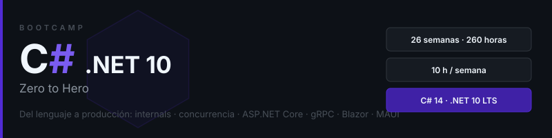

<p align="center">
  
</p>

<p align="center">
  <a href="LICENSE"></a>
  <a href="#"></a>
  <a href="#"></a>
  <a href="#"></a>
  <a href="#"></a>
</p>

<p align="center">
  <a href="README.md"></a>
</p>

---

## 📋 Overview

A **26-week (~6 months, 10 h/week, 260 h)** intensive bootcamp taking developers with prior experience in another language to **advanced C#/.NET**: deep language mastery (C# 14), CLR internals and performance, concurrency, backend with ASP.NET Core and EF Core, service communication with gRPC/SignalR/messaging, UI with Blazor and .NET MAUI, and production deployment with Docker and CI/CD.

> All course content (theory, exercises, projects) is written in **Spanish**. Code and identifiers are in English.

## 🎯 Outcomes

- ✅ Master C# 14 syntax and type system: classes, structs, records, enums, generics, variance
- ✅ Apply OOP, SOLID and design patterns with dependency injection
- ✅ Use delegates, events, lambdas, LINQ and pattern matching fluently
- ✅ Write correct async code with `async`/`await`, cancellation and `IAsyncEnumerable`
- ✅ Explain the CLR, JIT, GC and memory layout; measure with BenchmarkDotNet and dotnet-tools
- ✅ Write high-performance code with `Span<T>`, `ArrayPool`, `ref struct` and zero-allocation parsing
- ✅ Use reflection, attributes, source generators and Roslyn analyzers
- ✅ Program safe concurrency: `lock`, `Interlocked`, concurrent collections, `Parallel`, `Channel<T>`
- ✅ Build APIs with ASP.NET Core Minimal API, EF Core + PostgreSQL and OpenAPI
- ✅ Test with xUnit, NSubstitute, `WebApplicationFactory` and Testcontainers
- ✅ Connect services with gRPC, SignalR and messaging (RabbitMQ/MassTransit, outbox, idempotency)
- ✅ Build UIs with Blazor (SSR/Server/WASM) and mobile apps with .NET MAUI
- ✅ Containerize, deploy with GitHub Actions and operate with OpenTelemetry, health checks and resilience

## 🗓️ Structure

| Phase | Weeks | Hours |
|:-----:|:-----:|:-----:|
| **Accelerated fundamentals** | 01-03 | 30h |
| **OOP and design** | 04-06 | 30h |
| **Modern C#** | 07-10 | 40h |
| **Internals and performance** | 11-14 | 40h |
| **Concurrency and platform** | 15-18 | 40h |
| **Communication and events** | 19-20 | 20h |
| **UI: Blazor and MAUI** | 21-23 | 30h |
| **Production and final project** | 24-26 | 30h |

**Total: 26 weeks · 260 hours** — 150 theory files · 122 SVG diagrams · 50 exercises · 26 projects

## 📚 Weeks

| Week | Slug | Theory | SVG | Exercises |
|:----:|------|:------:|:---:|:---------:|
| 01 | `dotnet_setup_tipos_control_flujo` | 6 | 5 | 2 |
| 02 | `metodos_strings_colecciones` | 7 | 6 | 2 |
| 03 | `excepciones_io_json_debugging` | 5 | 3 | 2 |
| 04 | `clases_herencia_interfaces` | 7 | 6 | 2 |
| 05 | `structs_records_enums_genericos` | 6 | 5 | 2 |
| 06 | `solid_patrones_xunit` | 6 | 5 | 2 |
| 07 | `delegados_eventos_lambdas` | 5 | 4 | 2 |
| 08 | `linq` | 6 | 5 | 2 |
| 09 | `pattern_matching_nullable` | 5 | 4 | 2 |
| 10 | `async_await` | 6 | 5 | 2 |
| 11 | `clr_memoria_gc` | 6 | 6 | 2 |
| 12 | `alto_rendimiento_memoria` | 6 | 5 | 2 |
| 13 | `benchmarking_profiling` | 5 | 4 | 2 |
| 14 | `reflection_atributos_source_generators` | 6 | 5 | 2 |
| 15 | `concurrencia_paralelismo` | 6 | 6 | 2 |
| 16 | `aspnet_core_minimal_api` | 6 | 5 | 2 |
| 17 | `ef_core_persistencia` | 6 | 5 | 2 |
| 18 | `testing_calidad` | 6 | 4 | 2 |
| 19 | `grpc_signalr` | 6 | 5 | 2 |
| 20 | `mensajeria_eventos` | 6 | 5 | 2 |
| 21 | `blazor_fundamentos` | 6 | 4 | 2 |
| 22 | `blazor_avanzado` | 6 | 4 | 2 |
| 23 | `maui_multiplataforma` | 6 | 4 | 2 |
| 24 | `docker_cicd` | 5 | 4 | 2 |
| 25 | `observabilidad_resiliencia_seguridad` | 6 | 5 | 2 |
| 26 | `proyecto_final` | 3 | 3 | 0 |

Each week follows the same layout:

```
bootcamp/week-XX-topic/
├── README.md                 # Goals and contents
├── rubrica-evaluacion.md     # Grading rubric (30/40/30)
├── 0-assets/                 # SVG diagrams
├── 1-teoria/                 # Theory
├── 2-practicas/              # Guided exercises (uncomment pattern)
├── 3-proyecto/               # Weekly project (TODOs, unique domain per student)
├── 4-recursos/               # Free ebooks · videos · links
└── 5-glosario/               # Glossary
```

## 🛠️ Stack

.NET 10 SDK (LTS) · C# 14 · VS Code + C# Dev Kit · xUnit · FluentAssertions · NSubstitute · BenchmarkDotNet · Testcontainers · ASP.NET Core · EF Core 10 · PostgreSQL 16 · RabbitMQ · Redis · gRPC · SignalR · MassTransit · OpenTelemetry · Blazor · .NET MAUI (Android on Linux) · Docker · GitHub Actions

See [docs/setup](docs/setup/README.md) to install the environment.

## 📊 Grading

| Evidence | Weight |
|----------|:------:|
| Knowledge 🧠 | 30% |
| Performance 💪 | 40% |
| Product 📦 | 30% |

Minimum 70% per evidence type. Each learner works on a **unique domain** assigned by the instructor (anti-plagiarism policy).

## 📄 License

[CC BY-NC-SA 4.0](LICENSE) — ergrato-dev.
