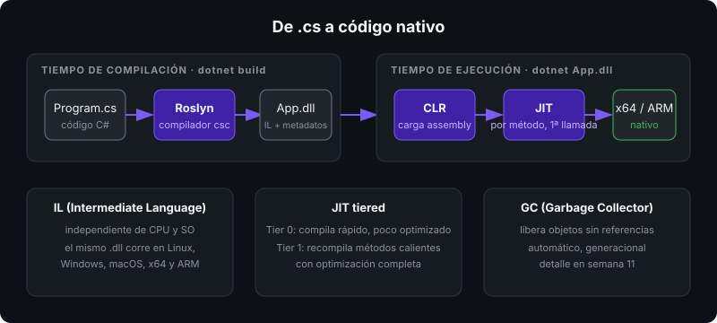

# Ecosistema .NET

## 🎯 Objetivos

Al finalizar este archivo, comprenderás:

- Qué es .NET, qué es C# y cómo se relacionan runtime, SDK y lenguaje
- Cómo se ejecuta un programa C#: compilación a IL y JIT en el CLR
- Qué significa que .NET 10 sea LTS y por qué este bootcamp usa C# 14
- Qué partes del ecosistema vas a usar y cuáles son legado

## 📋 Conceptos clave

### 1. Tres piezas: lenguaje, runtime y SDK

| Pieza | Qué es | Ejemplo |
|-------|--------|---------|
| **C#** | El lenguaje. Versionado por separado (C# 14) | `record`, `async`, pattern matching |
| **CLR** (Common Language Runtime) | Máquina virtual que ejecuta el código: JIT, GC, seguridad de tipos | `dotnet MiApp.dll` |
| **BCL** (Base Class Library) | Biblioteca estándar: `System.*` | `Console`, `List<T>`, `HttpClient` |
| **SDK** | Herramientas: compilador Roslyn, CLI `dotnet`, MSBuild, NuGet | `dotnet build` |

"**.NET**" nombra al conjunto: runtime + BCL + SDK. Un solo runtime ejecuta C#, F# y VB.NET porque todos compilan al mismo lenguaje intermedio.

> 💡 **Comparado con otros lenguajes**: Java tiene JVM + JDK + `javac`; .NET tiene CLR + SDK + Roslyn. Python y JavaScript interpretan/JIT-ean el fuente directamente; C# siempre pasa por un paso de compilación a IL.

### 2. Cómo se ejecuta tu código



1. **Roslyn** compila `.cs` a **IL** (Intermediate Language) dentro de un **assembly** (`MiApp.dll`). IL es independiente de CPU y sistema operativo.
2. Al ejecutar, el **CLR** carga el assembly y el **JIT** (Just-In-Time) traduce cada método a código nativo la primera vez que se llama.
3. El código nativo se cachea en memoria; llamadas posteriores no vuelven a compilar.
4. El **GC** (Garbage Collector) libera memoria automáticamente.

```csharp
// Esto es todo un programa válido en .NET 10 (top-level statements)
Console.WriteLine("Hello, .NET");
```

Detrás, el compilador genera una clase `Program` con un método `Main` — lo verás en la semana 11 cuando inspecciones IL.

### 3. Versiones: qué instalar y por qué

- **.NET 10** (noviembre 2025) es **LTS**: 3 años de soporte. Las versiones impares (9, 11) son STS: 18 meses.
- **C# 14** llega con .NET 10. El SDK decide la versión del lenguaje por defecto; no la fijes a mano salvo necesidad.
- Este repo fija el SDK en `global.json` para que todos compilen igual:

```json
{ "sdk": { "version": "10.0.401", "rollForward": "latestPatch" } }
```

### 4. Lo que NO vas a usar (y por qué existe)

| Nombre | Estado | Nota |
|--------|--------|------|
| .NET Framework 4.8 | Legado, solo Windows | Mantenimiento de apps viejas. No se instala aquí. |
| .NET Core 1–3.1 | Fin de vida | Predecesor del .NET actual (5+). |
| Mono / Xamarin | Absorbidos | Su sucesor es .NET MAUI (semana 23). |
| WebForms, WCF clásico | Solo .NET Framework | Sustituidos por ASP.NET Core y gRPC. |

Si un tutorial menciona `App.config`, `packages.config` o `Global.asax`, es .NET Framework: ignóralo.

### 5. Mapa del bootcamp sobre el ecosistema

- **Lenguaje** (semanas 1–10): C# 14 puro, consola.
- **Runtime** (11–15): CLR, GC, memoria, concurrencia.
- **Plataforma** (16–23): ASP.NET Core, EF Core, gRPC, SignalR, Blazor, MAUI.
- **Operación** (24–26): Docker, CI/CD, observabilidad.

Todo corre en Linux (WSL vale). .NET es multiplataforma desde 2016; el desarrollo en Windows no es requisito.

## 🔬 Bajo el capó

`dotnet run` hace tres cosas: `restore` (descarga paquetes NuGet), `build` (Roslyn → IL en `bin/Debug/net10.0/MiApp.dll`) y ejecuta `dotnet MiApp.dll`. El archivo `MiApp` sin extensión que aparece junto al `.dll` es un **apphost**: un ejecutable nativo mínimo que localiza el runtime y carga el `.dll`. Por eso puedes ejecutar `./bin/Debug/net10.0/MiApp` directamente.

El JIT de .NET es **tiered**: primero compila rápido con pocas optimizaciones (Tier 0) y recompila los métodos calientes con optimización completa (Tier 1). Lo medirás en la semana 13.

## ⚠️ Errores comunes

- Instalar el **runtime** en vez del **SDK**: sin SDK no hay `dotnet build`. Verifica con `dotnet --list-sdks`.
- Mezclar tutoriales de .NET Framework con .NET moderno.
- Ignorar `global.json`: si tu SDK no coincide, `dotnet` falla con `A compatible .NET SDK was not found`.

## 📚 Recursos adicionales

- [¿Qué es .NET?](https://learn.microsoft.com/dotnet/core/introduction)
- [Política de soporte de .NET](https://dotnet.microsoft.com/platform/support/policy/dotnet-core)
- [Historia de las versiones de C#](https://learn.microsoft.com/dotnet/csharp/whats-new/csharp-version-history)
- [Novedades de C# 14](https://learn.microsoft.com/dotnet/csharp/whats-new/csharp-14)

## ✅ Checklist de verificación

- [ ] Explico la diferencia entre C#, CLR, BCL y SDK
- [ ] Describo el camino `.cs` → IL → JIT → nativo
- [ ] Sé qué significa LTS y por qué usamos .NET 10
- [ ] Reconozco un tutorial de .NET Framework y lo descarto
- [ ] `dotnet --list-sdks` muestra un SDK 10.0.x en mi máquina
