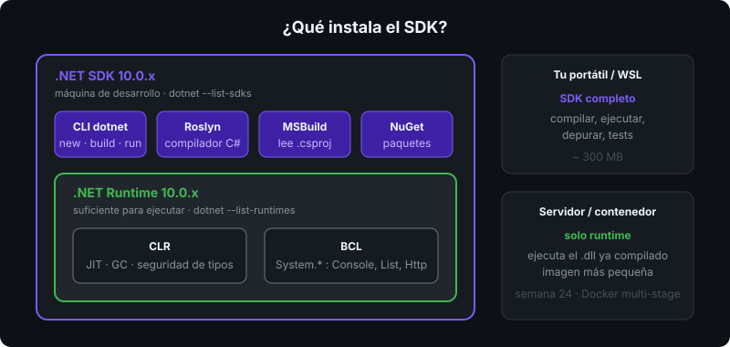
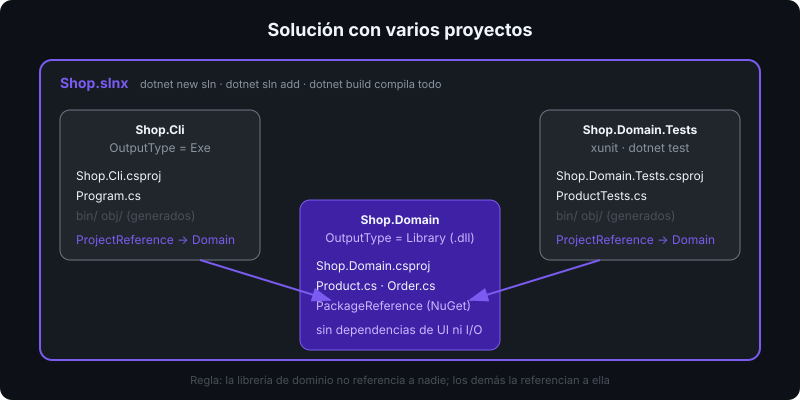

# CLI `dotnet`, proyectos y soluciones

## 🎯 Objetivos

Al finalizar este archivo, comprenderás:

- Los comandos esenciales de la CLI `dotnet` y qué genera cada uno
- La anatomía de un `.csproj` y las propiedades que este bootcamp exige
- Cuándo usar una solución (`.sln`/`.slnx`) y cómo se relacionan varios proyectos
- Qué son `bin/`, `obj/` y por qué nunca se comitean

## 📋 Conceptos clave

### 1. Comandos que usarás a diario



```bash
dotnet --info                       # versiones, runtimes, SO
dotnet new list                     # plantillas disponibles
dotnet new console -n Calculator    # crea carpeta Calculator/ con Calculator.csproj
cd Calculator
dotnet run                          # restore + build + ejecutar
dotnet build -warnaserror           # compilar tratando warnings como errores
dotnet add package Xunit --version 2.9.3   # dependencia NuGet, versión exacta
dotnet clean                        # borra bin/ y obj/
```

`dotnet run` es cómodo pero lento: recompila si algo cambió. Para ejecutar el binario ya compilado: `dotnet bin/Debug/net10.0/Calculator.dll`.

> 💡 **.NET 10 permite apps de un solo archivo**: `dotnet run hello.cs` compila y ejecuta un `.cs` suelto sin `.csproj`. Útil para probar ideas; el bootcamp usa proyectos porque necesitamos configuración y paquetes.

### 2. Anatomía de un `.csproj`

Es un archivo MSBuild en XML. El que usamos en todos los `starter/`:

```xml
<Project Sdk="Microsoft.NET.Sdk">
  <PropertyGroup>
    <OutputType>Exe</OutputType>              <!-- Exe = ejecutable; Library = .dll sin Main -->
    <TargetFramework>net10.0</TargetFramework> <!-- runtime objetivo -->
    <Nullable>enable</Nullable>               <!-- referencias anulables (semana 09) -->
    <ImplicitUsings>enable</ImplicitUsings>   <!-- using System; etc. automáticos -->
    <TreatWarningsAsErrors>true</TreatWarningsAsErrors> <!-- disciplina desde el día 1 -->
  </PropertyGroup>
</Project>
```

- `Sdk="Microsoft.NET.Sdk"` incluye por convención todos los `.cs` de la carpeta. No hay que listarlos.
- `ImplicitUsings` añade `System`, `System.IO`, `System.Linq`, `System.Collections.Generic`, `System.Threading.Tasks` y otros. Por eso `Console.WriteLine` funciona sin `using System;`.
- Un paquete NuGet aparece como `<PackageReference Include="Xunit" Version="2.9.3" />` dentro de un `<ItemGroup>`.

### 3. Estructura de carpetas generada

```
Calculator/
├── Calculator.csproj
├── Program.cs
├── bin/Debug/net10.0/     # salida compilada: Calculator.dll, apphost, .pdb, .deps.json
└── obj/                   # intermedios: restore, IL parcial, project.assets.json
```

`bin/` y `obj/` se regeneran; están en `.gitignore`. Si algo raro pasa con paquetes, `dotnet clean` o borrar `obj/` suele arreglarlo.

### 4. Soluciones: varios proyectos juntos



Una **solución** agrupa proyectos que se compilan juntos: la app, una librería de dominio y sus tests.

```bash
dotnet new sln -n Shop                          # Shop.slnx (formato XML nuevo en .NET 10)
dotnet new classlib -n Shop.Domain
dotnet new console  -n Shop.Cli
dotnet new xunit    -n Shop.Domain.Tests
dotnet sln add Shop.Domain Shop.Cli Shop.Domain.Tests
dotnet add Shop.Cli reference Shop.Domain       # ProjectReference
dotnet add Shop.Domain.Tests reference Shop.Domain
dotnet build                                    # compila toda la solución
dotnet test                                     # ejecuta los tests
```

Hasta la semana 06 basta un proyecto de consola por ejercicio. Las soluciones aparecen con SOLID y tests.

### 5. Configuraciones Debug y Release

```bash
dotnet build -c Release     # optimizaciones del JIT activadas, sin símbolos extra
dotnet run -c Release
```

`Debug` es el valor por defecto: sin optimizar, con `.pdb` para el depurador. Los benchmarks (semana 13) exigen `Release`; medir en `Debug` es medir nada.

## 🔬 Bajo el capó

`dotnet restore` resuelve el grafo de paquetes y escribe `obj/project.assets.json`; `dotnet build` lee ese archivo y llama a MSBuild, que invoca a Roslyn (`csc.dll`) con la lista de fuentes y referencias. Puedes ver el comando exacto con `dotnet build -v detailed | grep csc`. Cada `PropertyGroup` del `.csproj` termina como un parámetro de línea de comandos del compilador: `<Nullable>enable</Nullable>` es `/nullable+`, `<TreatWarningsAsErrors>` es `/warnaserror+`.

## ⚠️ Errores comunes

- Ejecutar `dotnet run` fuera de la carpeta del proyecto: `Couldn't find a project to run`. Usa `dotnet run --project ruta/App.csproj`.
- Dos `.csproj` en la misma carpeta: MSBuild no sabe cuál usar.
- Comitear `bin/` u `obj/`.
- Usar `dotnet add package` sin `--version`: instala la última y rompe la homogeneidad del repo.

## 📚 Recursos adicionales

- [Referencia de la CLI dotnet](https://learn.microsoft.com/dotnet/core/tools/)
- [Referencia de propiedades MSBuild para el SDK](https://learn.microsoft.com/dotnet/core/project-sdk/msbuild-props)
- [Apps basadas en archivo (`dotnet run app.cs`)](https://learn.microsoft.com/dotnet/core/sdk/file-based-apps)

## ✅ Checklist de verificación

- [ ] Creo, compilo y ejecuto un proyecto de consola desde la terminal
- [ ] Explico cada propiedad del `.csproj` del bootcamp
- [ ] Sé qué contienen `bin/` y `obj/` y por qué no se comitean
- [ ] Creo una solución con dos proyectos y una referencia entre ellos
- [ ] Distingo Debug de Release
