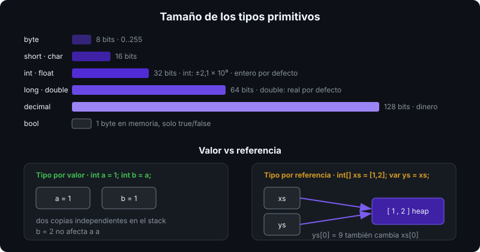

# Tipos primitivos y variables

## 🎯 Objetivos

Al finalizar este archivo, comprenderás:

- Los tipos numéricos, `bool`, `char` y `string`, con su tamaño y rango
- La diferencia entre tipos por valor y por referencia (primera aproximación)
- Cómo declarar variables con tipo explícito, `var` y `const`
- Cómo escribir literales correctamente (sufijos, separadores, verbatim, raw strings)

## 📋 Conceptos clave

### 1. C# es de tipado estático y fuerte

Cada variable tiene un tipo conocido en compilación y no cambia. El compilador rechaza `int x = "hola"`. Esto es lo que da a C# su rendimiento y su tooling (autocompletado, refactors seguros).

> 💡 **Comparado con otros lenguajes**: como Java o TypeScript con `strict`, a diferencia de Python o JavaScript. `var` NO es dinámico: es inferencia de tipo en compilación (como `auto` en C++ o `let` en TS).

### 2. Tipos numéricos



| Tipo C# | Alias de | Bits | Rango | Uso típico |
|---------|----------|:----:|-------|------------|
| `byte` | `System.Byte` | 8 | 0..255 | bytes crudos, I/O |
| `sbyte` | `System.SByte` | 8 | -128..127 | raro |
| `short` | `System.Int16` | 16 | ±32 767 | raro |
| `int` | `System.Int32` | 32 | ±2,1 × 10⁹ | **entero por defecto** |
| `long` | `System.Int64` | 64 | ±9,2 × 10¹⁸ | ids, timestamps, tamaños |
| `uint`, `ulong`, `ushort` | — | — | sin signo | interop, bits |
| `float` | `System.Single` | 32 | ~7 dígitos | gráficos, ML |
| `double` | `System.Double` | 64 | ~15 dígitos | **real por defecto** |
| `decimal` | `System.Decimal` | 128 | 28 dígitos exactos | **dinero** |
| `nint`, `nuint` | — | 32/64 | tamaño de puntero | interop nativo |

Los nombres en minúscula son **alias** de tipos de la BCL: `int` e `Int32` son idénticos. Por convención se usa el alias.

```csharp
int count = 42;
long fileSize = 3_500_000_000L;   // sufijo L: literal long; _ separa dígitos
double ratio = 0.75;              // literal real es double por defecto
float speed = 1.5f;               // sufijo f obligatorio
decimal price = 19.99m;           // sufijo m obligatorio: sin él sería double
```

**`double` no sirve para dinero**: `0.1 + 0.2 == 0.30000000000000004`. `decimal` es exacto en base 10 y algo más lento. Regla: dinero y contabilidad → `decimal`; ciencia y gráficos → `double`.

### 3. `bool`, `char` y `string`

```csharp
bool isActive = true;             // solo true/false; no hay "truthy": if (count) no compila
char initial = 'A';               // 16 bits, un code unit UTF-16, comillas simples
string name = "Ada";              // secuencia inmutable de char, comillas dobles
```

`string` es un tipo por **referencia** pero se comporta como valor en comparaciones: `"a" == "a"` es `true` por contenido. Es **inmutable**: cada modificación crea un string nuevo (detalle en la semana 02).

### 4. Literales de string

```csharp
string path = "C:\\temp\\log.txt";          // escape clásico
string verbatim = @"C:\temp\log.txt";       // verbatim: sin escapes
string greeting = $"Hola, {name}!";         // interpolación
string json = """
    { "name": "Ada", "age": 36 }
    """;                                     // raw string: sin escapes, multilínea
string both = $$"""{ "user": "{{name}}" }""";  // raw + interpolación con {{ }}
```

### 5. Declaración: explícito, `var`, `const`

```csharp
int explicitCount = 10;
var inferredCount = 10;            // int, inferido; no cambia de tipo
var total = 10.5;                  // double
const double Pi = 3.14159;         // constante en compilación; se sustituye en el IL
// var x;                          // ERROR: var exige inicializador
// const var y = 1;                // ERROR: const exige tipo explícito
```

Guía del bootcamp: `var` cuando el tipo se lee en el lado derecho (`var list = new List<int>()`), explícito cuando aporta claridad (`decimal total = Calculate()`).

### 6. Valor vs referencia (anticipo)

Los tipos de la tabla numérica, `bool`, `char` y los `struct` son **tipos por valor**: la variable contiene el dato. `string`, arrays y las `class` son **tipos por referencia**: la variable contiene una dirección al dato en el heap.

```csharp
int a = 1; int b = a; b = 2;               // a sigue siendo 1: se copió el valor
int[] xs = [1, 2]; int[] ys = xs; ys[0] = 9; // xs[0] es 9: ambas apuntan al mismo array
```

Semana 05 lo trata a fondo con `struct` y `class`.

### 7. Valores por defecto y `default`

Todo tipo tiene un valor por defecto: `0` para numéricos, `false`, `'\0'`, `null` para referencias. `default(int)` o simplemente `default` lo produce. Una variable local **debe** asignarse antes de leerse: el compilador lo verifica (`CS0165: Use of unassigned local variable`).

## 🔬 Bajo el capó

`int.MaxValue + 1` no lanza excepción por defecto: **desborda** silenciosamente a `int.MinValue` porque la suma de enteros en IL (`add`) ignora el acarreo. Con `checked { ... }` o el flag `<CheckForOverflowUnderflow>` el compilador emite `add.ovf`, que lanza `OverflowException`. Se ve en el siguiente archivo.

`const` no ocupa memoria en runtime: el compilador incrusta el valor literal en cada sitio de uso. Por eso solo admite tipos primitivos y `string`.

## ⚠️ Errores comunes

- `decimal price = 19.99;` no compila: falta el sufijo `m`.
- Usar `float`/`double` para dinero.
- `int` para tamaños de archivo o ids de bases de datos grandes: desborda a los 2 GB / 2 × 10⁹ registros.
- Confundir `'A'` (char) con `"A"` (string).

## 📚 Recursos adicionales

- [Tipos integrados](https://learn.microsoft.com/dotnet/csharp/language-reference/builtin-types/built-in-types)
- [Tipos numéricos integrales](https://learn.microsoft.com/dotnet/csharp/language-reference/builtin-types/integral-numeric-types)
- [Raw string literals](https://learn.microsoft.com/dotnet/csharp/language-reference/tokens/raw-string)

## ✅ Checklist de verificación

- [ ] Elijo entre `int`, `long`, `double` y `decimal` con criterio
- [ ] Escribo literales con sufijos correctos y separadores `_`
- [ ] Explico qué hace `var` y cuándo usarlo
- [ ] Distingo tipos por valor y por referencia en un ejemplo simple
- [ ] Uso raw strings para JSON o rutas multilínea
