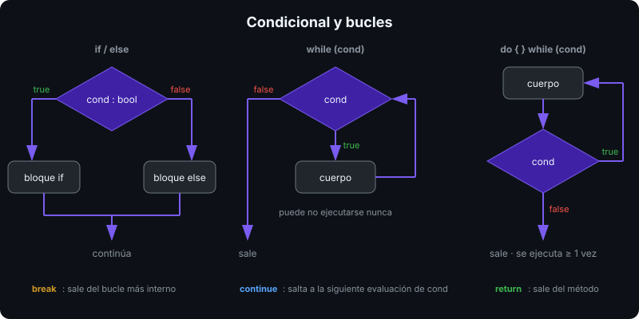

# Condicionales y bucles

## 🎯 Objetivos

Al finalizar este archivo, comprenderás:

- `if`/`else if`/`else` y el `switch` clásico con `case` y `break`
- Los cuatro bucles: `while`, `do-while`, `for` y `foreach`, y cuándo usar cada uno
- `break`, `continue`, `return` y `goto` como control de flujo
- El ámbito (scope) de variables dentro de bloques

## 📋 Conceptos clave

### 1. `if` / `else`



```csharp
int temperature = 23;

if (temperature < 0)
{
    Console.WriteLine("Congelación");
}
else if (temperature < 20)
{
    Console.WriteLine("Fresco");
}
else
{
    Console.WriteLine("Templado");
}
```

La condición **debe** ser `bool`. `if (temperature)` no compila. Las llaves son opcionales para una sola instrucción, pero el bootcamp las exige siempre: evita el clásico bug de añadir una segunda línea que queda fuera del `if`.

**Early return**: prefiere salir pronto a anidar.

```csharp
static string Classify(int age)
{
    if (age < 0) return "inválido";
    if (age < 18) return "menor";
    return "adulto";
}
```

### 2. `switch` clásico

```csharp
string day = "sat";
switch (day)
{
    case "sat":
    case "sun":                       // varios case comparten cuerpo (fall-through solo si están vacíos)
        Console.WriteLine("Fin de semana");
        break;                        // obligatorio: C# no permite caer al siguiente case con código
    case "mon":
        Console.WriteLine("Lunes");
        break;
    default:
        Console.WriteLine("Entre semana");
        break;
}
```

Funciona con enteros, `char`, `string`, enums y, desde C# 7, con patrones (`case int n when n > 10:`). El siguiente archivo muestra la forma moderna: `switch` **expression**.

### 3. `while` y `do-while`

```csharp
int attempts = 0;
while (attempts < 3)                  // evalúa antes; puede no ejecutarse nunca
{
    attempts++;
}

string? input;
do
{
    Console.Write("Escribe 'salir': ");
    input = Console.ReadLine();
} while (input != "salir");           // evalúa después; se ejecuta al menos una vez
```

`do-while` es el bucle natural para menús y validación de entrada: siempre hay que preguntar al menos una vez.

### 4. `for`

```csharp
for (int i = 0; i < 10; i++)          // inicialización; condición; paso
{
    Console.Write(i);
}
for (int i = 10; i >= 0; i -= 2) { }  // cuenta atrás de dos en dos
for (int i = 0, j = 9; i < j; i++, j--) { }  // dos variables
```

Usa `for` cuando necesitas el índice o un paso no trivial. La variable `i` solo existe dentro del bucle.

### 5. `foreach`

```csharp
string[] names = ["Ada", "Linus", "Grace"];
foreach (string name in names)
{
    Console.WriteLine(name);
}
foreach (var (index, name) in names.Index())   // .NET 9+: índice y valor sin for manual
{
    Console.WriteLine($"{index}: {name}");
}
```

`foreach` recorre cualquier cosa **enumerable**: arrays, `List<T>`, `Dictionary<K,V>`, strings (`char` a `char`), resultados LINQ. La variable de iteración es de solo lectura: `name = "x"` no compila. Modificar la colección mientras la recorres lanza `InvalidOperationException`.

> 💡 **Comparado con otros lenguajes**: es el `for...of` de JavaScript o el `for x in xs` de Python. El `for (init; cond; step)` es idéntico al de C/Java.

### 6. `break`, `continue`, `return`, `goto`

```csharp
foreach (int n in numbers)
{
    if (n < 0) continue;              // salta al siguiente elemento
    if (n > 100) break;               // sale del bucle
    Console.WriteLine(n);
}
```

`break` solo sale del bucle **más interno**. Para salir de bucles anidados: extrae a un método y usa `return`, o usa una bandera. `goto` existe (`goto case`, `goto label`) pero no se usa en este bootcamp fuera del `switch`.

### 7. Ámbito de variables

```csharp
int outer = 1;
{
    int inner = 2;                    // visible solo en este bloque
    // int outer = 3;                 // ERROR CS0136: ya existe en un ámbito que lo contiene
}
// inner no existe aquí
for (int i = 0; i < 3; i++) { }
for (int i = 0; i < 5; i++) { }       // OK: cada for tiene su propio i
```

C# no permite **sombrear** (shadowing) una variable local de un bloque exterior. Es más estricto que Java o JS.

### 8. Bucle infinito controlado

```csharp
while (true)
{
    string? command = Console.ReadLine();
    if (command is null or "exit") break;
    Handle(command);
}
```

Patrón estándar para REPLs, menús y servidores. El proyecto de esta semana lo usa.

## 🔬 Bajo el capó

Todos los bucles se compilan a lo mismo: comparaciones y saltos condicionales (`br`, `brtrue`, `blt` en IL). `foreach` sobre un **array** se convierte en un `for` con índice: sin coste extra. `foreach` sobre una `List<T>` usa un `struct` enumerator (`List<T>.Enumerator`) que tampoco asigna memoria. `foreach` sobre `IEnumerable<T>` genérico llama a `GetEnumerator()`, `MoveNext()` y `Current` a través de interfaz: un poco más caro y con posible asignación. Lo medirás en la semana 13.

## ⚠️ Errores comunes

- Olvidar `break` en un `case` con código: error de compilación `CS0163`.
- Modificar una `List<T>` dentro de un `foreach` sobre ella misma.
- `for (int i = 0; i <= array.Length; i++)`: `IndexOutOfRangeException` en la última iteración.
- `while (input != "salir")` con `input` sin inicializar antes del `while`: usa `do-while`.
- Anidar 4 niveles de `if`: extrae métodos o usa early return.

## 📚 Recursos adicionales

- [Instrucciones de selección](https://learn.microsoft.com/dotnet/csharp/language-reference/statements/selection-statements)
- [Instrucciones de iteración](https://learn.microsoft.com/dotnet/csharp/language-reference/statements/iteration-statements)
- [Instrucciones de salto](https://learn.microsoft.com/dotnet/csharp/language-reference/statements/jump-statements)

## ✅ Checklist de verificación

- [ ] Elijo el bucle adecuado para cada situación y lo justifico
- [ ] Escribo un menú con `do-while` o `while (true)` + `break`
- [ ] Uso `continue` y `break` sin banderas innecesarias
- [ ] Aplico early return para reducir anidamiento
- [ ] Explico por qué C# rechaza sombrear una variable local
