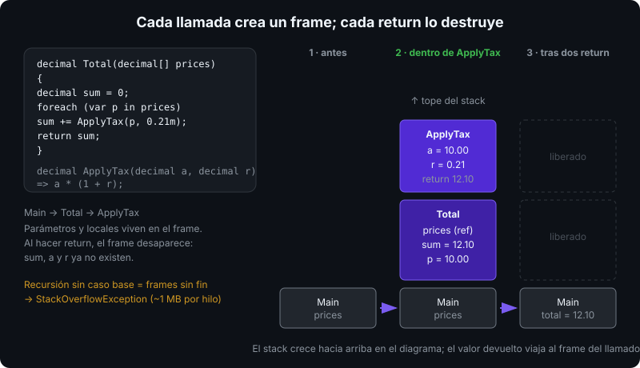
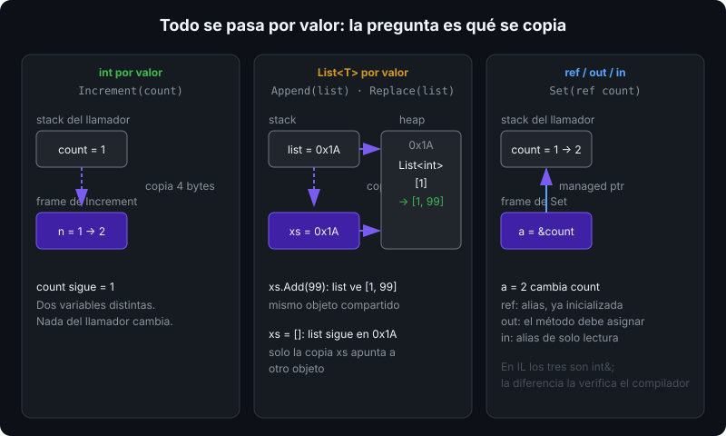

# Métodos y parámetros

## 🎯 Objetivos

Al finalizar este archivo, comprenderás:

- Cómo se declara un método: firma, tipo de retorno, `static`, expression-bodied
- Qué ocurre al pasar un argumento por valor, y por qué los tipos por referencia "parecen" pasarse por referencia
- Cuándo usar `ref`, `out`, `in` y `params`, y qué garantiza cada uno
- Argumentos con nombre y valores por defecto, y las funciones locales

## 📋 Conceptos clave

### 1. Anatomía de un método

```csharp
// modificadores  retorno  nombre     parámetros
static           decimal  ApplyTax(decimal amount, decimal rate)
{
    return amount * (1 + rate);
}

// expression-bodied: un solo return, sin llaves
static decimal ApplyTax(decimal amount, decimal rate) => amount * (1 + rate);

// void: no devuelve nada
static void Log(string message) => Console.WriteLine($"[LOG] {message}");
```

La **firma** es nombre + tipos de parámetros (no el retorno, no los nombres). Con top-level statements (`Program.cs` sin `Main`) los métodos se escriben debajo del código principal y son funciones locales `static` implícitas.



Cada llamada crea un **stack frame** con sus parámetros y locales; al hacer `return` el frame desaparece. Por eso una variable local no sobrevive al método.

### 2. Paso por valor: la regla por defecto

En C# **todo argumento se pasa por valor**: el método recibe una copia. La confusión clásica viene de qué se copia:

```csharp
static void Increment(int n) => n++;             // modifica la copia local
static void Append(List<int> xs) => xs.Add(99);  // modifica el objeto compartido
static void Replace(List<int> xs) => xs = [];    // reasigna la copia de la referencia

int count = 1;
Increment(count);                 // count sigue siendo 1
var list = new List<int> { 1 };
Append(list);                     // list es [1, 99]: se copió la REFERENCIA, no la lista
Replace(list);                    // list sigue siendo [1, 99]: la variable del llamador no cambia
```



Con un tipo por valor (`int`, `struct`) se copia el dato. Con un tipo por referencia (`List<T>`, `string`, clases) se copia la **referencia**: ambos alias apuntan al mismo objeto, pero reasignar el parámetro no afecta al llamador.

### 3. `ref`: alias a la variable del llamador

```csharp
static void Swap(ref int a, ref int b) => (a, b) = (b, a);

int x = 1, y = 2;
Swap(ref x, ref y);   // ref obligatorio también en la llamada: x = 2, y = 1
```

`ref` pasa la variable misma, no una copia. La variable debe estar inicializada antes. Es explícito en ambos lados a propósito: quien lee la llamada sabe que `x` puede cambiar.

### 4. `out`: el método debe asignar

```csharp
static bool TryDivide(int dividend, int divisor, out int quotient)
{
    if (divisor == 0)
    {
        quotient = 0;      // obligatorio asignar en TODOS los caminos
        return false;
    }
    quotient = dividend / divisor;
    return true;
}

if (TryDivide(10, 3, out int q)) Console.WriteLine(q);   // declaración inline
TryDivide(10, 0, out _);                                 // descartar con _
```

Es el patrón `TryXxx` de toda la BCL (`int.TryParse`, `Dictionary.TryGetValue`). Diferencia con `ref`: la variable puede no estar inicializada al entrar, y el método está obligado a asignarla.

### 5. `in`: referencia de solo lectura

```csharp
readonly record struct Point3D(double X, double Y, double Z);   // 24 bytes

static double Length(in Point3D p) => Math.Sqrt(p.X * p.X + p.Y * p.Y + p.Z * p.Z);

var p = new Point3D(1, 2, 2);
Console.WriteLine(Length(p));      // in es opcional en la llamada
```

`in` evita copiar structs grandes (>16 bytes) y prohíbe modificarlos. Con un `int` no aporta nada: copiar 4 bytes es más barato que desreferenciar. Detalle de rendimiento en la semana 12.

### 6. `params`: número variable de argumentos

```csharp
static int Sum(params int[] values)
{
    int total = 0;
    foreach (int v in values) total += v;
    return total;
}

Sum();            // 0: array vacío
Sum(1, 2, 3);     // 6
Sum([4, 5]);      // también acepta un array o collection expression
```

Desde C# 13 `params` admite `ReadOnlySpan<T>`, `IEnumerable<T>` y otras colecciones: `params ReadOnlySpan<int> values` evita asignar el array en el heap.

### 7. Valores por defecto y argumentos con nombre

```csharp
static string Greet(string name, string greeting = "Hola", bool shout = false)
{
    string text = $"{greeting}, {name}";
    return shout ? text.ToUpperInvariant() : text;
}

Greet("Ada");                          // Hola, Ada
Greet("Ada", shout: true);             // HOLA, ADA — salta greeting usando el nombre
Greet(greeting: "Hey", name: "Ada");   // el orden no importa si todos van con nombre
```

Los parámetros opcionales van al final. El valor por defecto debe ser constante en compilación (`null`, literales, `default`).

### 8. Funciones locales

```csharp
static int[] ParseAll(string[] tokens)
{
    var result = new int[tokens.Length];
    for (int i = 0; i < tokens.Length; i++) result[i] = ParseOrZero(tokens[i]);
    return result;

    // visible solo dentro de ParseAll; static impide capturar variables externas
    static int ParseOrZero(string s) => int.TryParse(s, out int n) ? n : 0;
}
```

Úsalas para helpers que no tienen sentido fuera de un método. Prefiere `static` si no necesitan capturar locales: evita asignaciones ocultas (closures, semana 07).

## 🔬 Bajo el capó

Una llamada a método emite `call` en IL; los argumentos se apilan en el orden declarado y el callee los recibe en registros o en el stack según la convención de llamada de la plataforma (x64 SysV en Linux: primeros 6 enteros en registros). `ref`, `out` e `in` se compilan igual: un **managed pointer** (`int&` en IL) a la variable original; la diferencia es solo verificación del compilador. `params int[]` asigna un array en el heap por cada llamada sin array explícito; `params ReadOnlySpan<T>` lo evita usando el stack. El JIT puede **inlinear** métodos pequeños (típicamente < 16 bytes de IL): un expression-bodied como `ApplyTax` suele desaparecer como llamada.

## ⚠️ Errores comunes

- Esperar que `Increment(count)` cambie `count`: sin `ref`, no.
- Creer que una `List<T>` "se pasa por referencia": se copia la referencia. `xs = []` dentro del método no afecta fuera.
- Olvidar `ref`/`out` en la llamada: error CS1620.
- Usar `in` con tipos pequeños "por rendimiento": no ayuda, y puede empeorar por copias defensivas.
- Parámetro `out` no asignado en un `if` sin `else`: error CS0177.

## 📚 Recursos adicionales

- [Métodos (guía de C#)](https://learn.microsoft.com/dotnet/csharp/programming-guide/classes-and-structs/methods)
- [Modificadores de parámetros `ref`, `out`, `in`](https://learn.microsoft.com/dotnet/csharp/language-reference/keywords/method-parameters)
- [`params` con colecciones (C# 13)](https://learn.microsoft.com/dotnet/csharp/language-reference/keywords/method-parameters#params-modifier)

## ✅ Checklist de verificación

- [ ] Predigo qué imprime un programa que muta un `int` y una `List<T>` dentro de un método
- [ ] Explico la diferencia entre `ref`, `out` e `in` en una frase cada uno
- [ ] Escribo un método `TryXxx` con `out` correctamente asignado en todos los caminos
- [ ] Uso `params` y argumentos con nombre cuando mejoran la legibilidad
- [ ] Sé qué es un stack frame y por qué las locales no sobreviven al `return`
