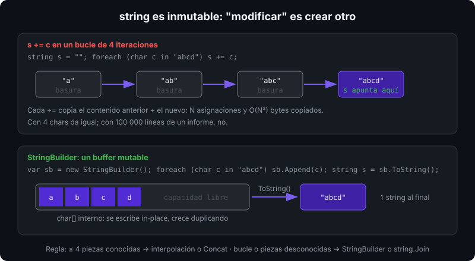

# Strings y `StringBuilder`

## 🎯 Objetivos

Al finalizar este archivo, comprenderás:

- Qué significa que `string` sea inmutable y qué consecuencias tiene en memoria y rendimiento
- Los métodos de la BCL para buscar, cortar, comparar y transformar texto
- Cómo comparar strings correctamente con `StringComparison`
- Cuándo `StringBuilder` es necesario y cuándo es ruido

## 📋 Conceptos clave

### 1. `string` es inmutable

Un `string` es una secuencia de `char` (UTF-16) que **nunca cambia** después de crearse. Todo método que "modifica" devuelve un string nuevo:

```csharp
string name = "ada";
name.ToUpper();                     // no hace nada visible: el resultado se descarta
string upper = name.ToUpper();      // "ADA" es un objeto nuevo; name sigue siendo "ada"
```



Ventajas: seguro entre hilos, usable como clave de diccionario, el hash se puede cachear. Coste: concatenar en bucle crea un objeto por iteración.

### 2. Construir y unir

```csharp
string full = "Ada" + " " + "Lovelace";           // el compilador lo pliega a un literal
string greeting = $"Hola, {full}!";               // interpolación: la forma preferida
string csv = string.Join(", ", ["a", "b", "c"]);  // "a, b, c"
string padded = "7".PadLeft(3, '0');              // "007"
string repeated = new string('-', 20);            // 20 guiones
```

`+` entre variables asigna un string intermedio por cada operador: `a + b + c + d` en una expresión se compila a `string.Concat(a, b, c, d)` (una sola asignación), pero en un bucle son n asignaciones.

### 3. Buscar y cortar

```csharp
string path = "/home/ada/notes.md";
path.Length;                          // 18 (número de char, no de bytes)
path.Contains("ada");                 // true
path.StartsWith("/home");             // true
path.IndexOf('/');                    // 0; -1 si no está
path.LastIndexOf('/');                // 9
path.Substring(10);                   // "notes.md"
path[10..];                           // igual, con rango (archivo 07)
path.Split('/', StringSplitOptions.RemoveEmptyEntries);   // ["home", "ada", "notes.md"]
"  x  ".Trim();                       // "x"; también TrimStart/TrimEnd
path.Replace(".md", ".txt");          // nuevo string
```

`Split` sin opciones conserva entradas vacías: `"a,,b".Split(',')` da tres elementos.

### 4. Comparar: nunca `ToLower() ==`

```csharp
string a = "Straße", b = "STRASSE";
a == b;                                                  // false: ordinal, char a char
a.Equals(b, StringComparison.OrdinalIgnoreCase);         // false: ß no es ss ordinalmente
a.Equals(b, StringComparison.InvariantCultureIgnoreCase); // true en algunas versiones de ICU
string.Compare(a, b, StringComparison.Ordinal);          // <0, 0, >0 para ordenar
```

Regla del bootcamp: identificadores, claves, rutas, protocolos → `Ordinal` / `OrdinalIgnoreCase` (rápido, determinista). Texto mostrado al usuario y ordenado alfabéticamente → `CurrentCulture`. `ToLower()` para comparar asigna un string nuevo y depende de la cultura: el famoso bug de la "i" turca.

### 5. Caracteres y Unicode

```csharp
string emoji = "👍";
emoji.Length;                                    // 2: dos char UTF-16 (surrogate pair)
foreach (Rune r in emoji.EnumerateRunes()) { }   // 1 rune: el code point real
char.IsDigit('7'); char.IsLetter('ñ'); char.IsWhiteSpace('\t');
(char)('a' + 1);                                 // 'b': char es numérico
```

`Length` cuenta `char`, no caracteres visibles. Para texto de usuario con emojis o acentos combinados, `StringInfo.GetTextElementEnumerator` o `EnumerateRunes`.

### 6. Literales verbatim y raw

```csharp
string win = @"C:\Users\ada";           // verbatim: sin escapes; "" para comillas
string json = """
    {
      "name": "Ada"
    }
    """;                                // raw (C# 11): sin escapes, indentación relativa al cierre
string mixed = $"""{{ "id": {42} }}""";  // raw interpolado
```

### 7. `StringBuilder`: buffer mutable

```csharp
using System.Text;

var sb = new StringBuilder(capacity: 256);
for (int i = 0; i < 1000; i++)
{
    sb.Append(i).Append(',');          // sin asignar strings intermedios
}
sb.Length--;                            // quitar la última coma
sb.AppendLine();
sb.Insert(0, "ids: ");
string result = sb.ToString();          // UNA asignación final
```

Cuándo usarlo: concatenación en bucle, construcción de informes, generación de código. Cuándo no: unir 3–4 piezas conocidas (interpolación es más clara y el compilador ya la optimiza), `string.Join` sobre una colección.

## 🔬 Bajo el capó

Un `string` en .NET es un objeto del heap con un header (16 bytes en x64), un `int` de longitud y los `char` inline: `"Ada"` ocupa 16 + 4 + 3×2 = 26 bytes, redondeado a 32. Los literales viven en el **intern pool**: `"a" == "a"` referencia el mismo objeto; `string.IsInterned` lo consulta. La inmutabilidad permite que el runtime comparta strings sin copiar y que `GetHashCode` se calcule una vez. `$"Hola, {name}"` desde C# 10 usa `DefaultInterpolatedStringHandler`: un buffer alquilado de `ArrayPool<char>` que formatea cada hueco sin `string` intermedios ni boxing de `int`. `StringBuilder` es una lista enlazada de chunks de `char[]`; crece duplicando y `ToString()` copia todo a un string final. En la semana 12 verás `Span<char>` y `string.Create` para construir strings sin ninguna copia extra.

## ⚠️ Errores comunes

- `name.ToUpper();` sin asignar el resultado.
- `a.ToLower() == b.ToLower()` en vez de `Equals(..., OrdinalIgnoreCase)`.
- `s += x` dentro de un bucle de miles de iteraciones.
- Usar `Length` para contar caracteres visibles con emojis.
- `Substring(start, length)` confundido con `Substring(start, end)`: el segundo argumento es la longitud.

## 📚 Recursos adicionales

- [Strings (guía de C#)](https://learn.microsoft.com/dotnet/csharp/programming-guide/strings/)
- [Buenas prácticas de comparación de strings](https://learn.microsoft.com/dotnet/standard/base-types/best-practices-strings)
- [`StringBuilder`](https://learn.microsoft.com/dotnet/api/system.text.stringbuilder)
- [Raw string literals (C# 11)](https://learn.microsoft.com/dotnet/csharp/language-reference/tokens/raw-string)

## ✅ Checklist de verificación

- [ ] Explico por qué `s.ToUpper()` sin asignación no cambia nada
- [ ] Elijo `Ordinal` o `CurrentCulture` según el uso del texto
- [ ] Uso `Split`, `Trim`, `IndexOf` y `Substring` sin consultar la documentación
- [ ] Sé qué mide `Length` y por qué un emoji vale 2
- [ ] Decido cuándo `StringBuilder` aporta y cuándo la interpolación basta
