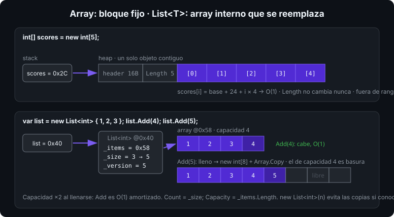

# Arrays

## 🎯 Objetivos

Al finalizar este archivo, comprenderás:

- Cómo declarar, inicializar y recorrer arrays unidimensionales
- La diferencia entre arrays multidimensionales `[,]` y jagged `[][]`
- Los métodos de `Array` y `System.Array`: `Sort`, `IndexOf`, `Fill`, `Copy`, `Resize`
- Por qué un array es un objeto del heap de tamaño fijo, y qué implica

## 📋 Conceptos clave

### 1. Declarar e inicializar

```csharp
int[] scores = new int[5];                 // 5 ceros: los elementos se inicializan a default
string[] names = ["Ada", "Alan", "Grace"]; // collection expression (C# 12), tamaño 3
double[] ratios = { 0.5, 0.25 };           // sintaxis clásica, equivalente
var empty = Array.Empty<int>();            // array vacío compartido, sin asignar

scores[0] = 90;
scores.Length;                             // 5: fijo para siempre
scores[5] = 1;                             // IndexOutOfRangeException en ejecución
```

Un array tiene tamaño fijo desde su creación. Para colecciones que crecen, `List<T>` (archivo 06).



Los elementos son **contiguos** en el heap: acceder a `scores[i]` es una suma de punteros, O(1), y recorrerlo en orden aprovecha la caché de la CPU.

### 2. Recorrer

```csharp
for (int i = 0; i < scores.Length; i++)    // con índice: cuando necesitas i o modificar
    scores[i] *= 2;

foreach (int s in scores)                  // sin índice: solo lectura, más claro
    Console.WriteLine(s);

// foreach NO permite asignar: s = 0 → error CS1656
```

`foreach` sobre un array se compila a un `for` con índice: mismo rendimiento, y el JIT elimina la comprobación de límites porque sabe que `i < Length`.

### 3. Array de tipos por valor vs por referencia

```csharp
int[] ints = new int[3];          // [0, 0, 0]: los datos viven dentro del array
string[] strs = new string[3];    // [null, null, null]: referencias nulas
Point[] points = new Point[3];    // struct: 3 Points con todos los campos a 0, inline
```

Con `Nullable` habilitado, `new string[3]` es un aviso de diseño: el compilador no puede protegerte del `null` en cada slot. Prefiere inicializar con datos o usar `List<string>`.

### 4. Métodos de `System.Array`

```csharp
int[] xs = [5, 3, 9, 1];
Array.Sort(xs);                          // [1, 3, 5, 9] in-place
Array.Reverse(xs);                       // [9, 5, 3, 1]
Array.IndexOf(xs, 5);                    // 1; -1 si no está
Array.BinarySearch(xs, 5);               // solo sobre array ordenado ascendente
Array.Fill(xs, 0);                       // todos a 0
Array.Exists(xs, x => x > 4);            // true/false
Array.Resize(ref xs, 8);                 // crea array nuevo, copia, reasigna la variable

int[] copy = new int[xs.Length];
Array.Copy(xs, copy, xs.Length);         // copia elemento a elemento
int[] clone = (int[])xs.Clone();         // copia superficial
```

`Array.Resize` no redimensiona nada: asigna un array nuevo y copia. Si lo haces en bucle, ya necesitas `List<T>`.

### 5. Arrays multidimensionales `[,]`

```csharp
int[,] grid = new int[3, 4];             // 3 filas × 4 columnas, un solo bloque contiguo
grid[1, 2] = 7;
grid.GetLength(0);                        // 3 filas
grid.GetLength(1);                        // 4 columnas
grid.Length;                              // 12 total

int[,] board = { { 1, 2 }, { 3, 4 } };    // inicializador rectangular
for (int r = 0; r < grid.GetLength(0); r++)
    for (int c = 0; c < grid.GetLength(1); c++)
        grid[r, c] = r * c;
```

Rectangular, un solo objeto. Ideal para matrices y tableros; el acceso `[r, c]` es un cálculo `r * cols + c`.

### 6. Arrays jagged `[][]`

```csharp
int[][] triangle = new int[3][];          // array de 3 referencias a arrays
triangle[0] = [1];
triangle[1] = [1, 1];
triangle[2] = [1, 2, 1];
triangle[2][1];                            // 2
triangle[1].Length;                        // 2: cada fila tiene su tamaño
```

Cada fila es un array independiente (puede ser `null` o de distinto tamaño). Más flexible, más objetos en el heap; suele ser **más rápido** que `[,]` para acceso por filas porque el JIT optimiza mejor el array unidimensional.

### 7. Copia y aliasing

```csharp
int[] a = [1, 2, 3];
int[] b = a;             // misma referencia: b[0] = 9 cambia a[0]
int[] c = [.. a];        // copia con spread (C# 12): independiente
```

Un array es un tipo por referencia. Pasarlo a un método copia la referencia: el método **puede modificar los elementos**. Si no quieres eso, devuelve `ReadOnlySpan<T>` o `IReadOnlyList<T>`.

## 🔬 Bajo el capó

`new int[5]` emite `newarr int32`: el GC reserva un objeto con header (16 bytes), la longitud (`int`, 4 bytes + padding) y 5 × 4 bytes contiguos, todo a cero (el GC ya entrega memoria limpia). `xs[i]` es `ldelem`: el JIT comprueba `i < Length` y lanza `IndexOutOfRangeException` si falla; en un `for (i < xs.Length)` esa comprobación se **elimina** (bounds check elimination). `int[,]` se compila a llamadas `Get`/`Set` en un tipo especial; `int[][]` son `ldelem.ref` + `ldelem.i4`, dos saltos de puntero. Un array de más de 85 000 bytes va al **Large Object Heap** (semana 11): `new byte[100_000]` no se mueve nunca y solo se libera en GC gen2. `Array.Empty<T>()` devuelve una instancia estática compartida: úsala en vez de `new T[0]` para no asignar.

## ⚠️ Errores comunes

- `for (i <= Length)`: un índice de más, `IndexOutOfRangeException`.
- Modificar dentro de `foreach`: no compila (arrays) o lanza (`List<T>`).
- Creer que `Array.Resize` es barato: copia todo el array.
- `int[3, 4]` cuando querías filas de tamaño distinto (`int[3][]`).
- Devolver un array interno de una clase: el llamador puede modificarlo.

## 📚 Recursos adicionales

- [Arrays (guía de C#)](https://learn.microsoft.com/dotnet/csharp/language-reference/builtin-types/arrays)
- [Clase `System.Array`](https://learn.microsoft.com/dotnet/api/system.array)
- [Arrays multidimensionales y jagged](https://learn.microsoft.com/dotnet/csharp/language-reference/builtin-types/arrays#multidimensional-arrays)

## ✅ Checklist de verificación

- [ ] Creo arrays con `new`, con inicializador y con collection expression
- [ ] Elijo `for` o `foreach` según necesite índice o modificar
- [ ] Distingo `[,]` de `[][]` y sé cuándo usar cada uno
- [ ] Explico por qué `b = a` con arrays produce aliasing y cómo copiar de verdad
- [ ] Sé qué hace `Array.Resize` y por qué en bucle es señal de usar `List<T>`
