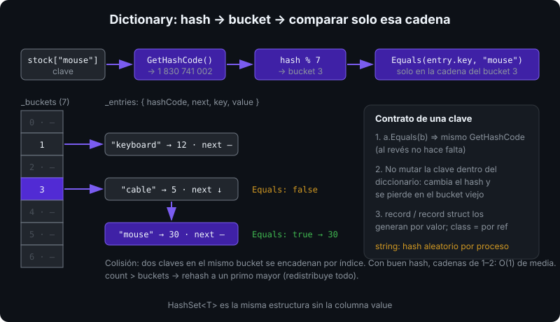
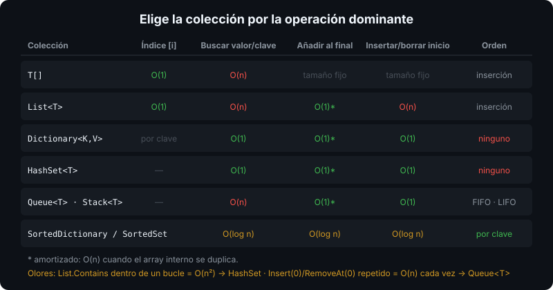

# `List<T>`, `Dictionary<K,V>` y `HashSet<T>`

## 🎯 Objetivos

Al finalizar este archivo, comprenderás:

- Cómo `List<T>` crece y por qué `Add` es O(1) amortizado
- Cómo `Dictionary<K,V>` y `HashSet<T>` consiguen búsquedas O(1) con hashing
- Qué exige un tipo para ser clave: `GetHashCode` y `Equals` coherentes
- Cuándo usar `Queue<T>`, `Stack<T>` y las interfaces `IEnumerable<T>` / `IReadOnlyList<T>`

## 📋 Conceptos clave

### 1. `List<T>`: el array que crece

```csharp
var names = new List<string> { "Ada", "Alan" };   // inicializador de colección
List<int> scores = [90, 85];                        // collection expression (archivo 07)

names.Add("Grace");                  // al final: O(1) amortizado
names.Insert(0, "Linus");            // al inicio: O(n), desplaza todo
names.Remove("Alan");                // busca (O(n)) y elimina desplazando
names.RemoveAt(names.Count - 1);     // por índice
names.Contains("Ada");               // O(n): recorre comparando
names.IndexOf("Grace");              // -1 si no está
names[0] = "Tim";                    // indexador: O(1)
names.Count;                         // elementos; Capacity: espacio reservado
names.Sort();                        // in-place, orden natural (IComparable<T>)
names.Sort((a, b) => b.Length.CompareTo(a.Length));   // con comparador
```


`List<T>` envuelve un array interno `T[]` y un `_size`. Cuando el array se llena, asigna otro del **doble** de capacidad y copia. Si conoces el tamaño final, pásalo: `new List<int>(10_000)` evita ~14 reasignaciones.

### 2. Modificar mientras se recorre

```csharp
var items = new List<int> { 1, 2, 3, 4 };
foreach (int i in items)
    if (i % 2 == 0) items.Remove(i);      // InvalidOperationException: collection was modified

items.RemoveAll(i => i % 2 == 0);          // correcto: [1, 3]
for (int i = items.Count - 1; i >= 0; i--) // o índice hacia atrás
    if (items[i] > 2) items.RemoveAt(i);
```

El enumerador guarda una **versión** de la lista; cualquier `Add`/`Remove` la invalida. `RemoveAll`, `for` descendente o construir una lista nueva son las salidas.

### 3. `Dictionary<TKey, TValue>`: búsqueda por clave

```csharp
var stock = new Dictionary<string, int>
{
    ["keyboard"] = 12,
    ["mouse"] = 30,
};

stock["cable"] = 5;                      // añade o sobrescribe
stock.Add("cable", 1);                   // ArgumentException: la clave ya existe
int n = stock["monitor"];                // KeyNotFoundException

if (stock.TryGetValue("monitor", out int count)) Console.WriteLine(count);
stock.TryAdd("mouse", 0);                // false: no sobrescribe
stock.ContainsKey("mouse");              // O(1)
stock.Remove("cable");                   // true si existía

foreach (var (key, value) in stock)      // deconstrucción del KeyValuePair
    Console.WriteLine($"{key}: {value}");

// contar ocurrencias: el patrón más común
var freq = new Dictionary<char, int>();
foreach (char c in "banana")
    freq[c] = freq.GetValueOrDefault(c) + 1;   // {b:1, a:3, n:2}
```



`Dictionary` calcula `key.GetHashCode()`, lo reduce a un índice de **bucket** y compara con `Equals` solo las entradas de ese bucket. Por eso buscar es O(1) de media aunque haya un millón de entradas. El orden de iteración **no está garantizado**: si necesitas orden por clave, `SortedDictionary<K,V>`.

### 4. `HashSet<T>`: conjunto sin duplicados

```csharp
var seen = new HashSet<string>(StringComparer.OrdinalIgnoreCase);
seen.Add("Ada");        // true
seen.Add("ada");        // false: ya existe (comparador sin mayúsculas)
seen.Contains("ADA");   // true, O(1)

HashSet<int> a = [1, 2, 3], b = [2, 3, 4];
a.IntersectWith(b);     // a = {2, 3}, in-place
a.UnionWith(b);         // a = {2, 3, 4}
a.IsSubsetOf(b);        // true
```

Es un `Dictionary` sin valores. Úsalo para "¿ya lo he visto?" y para álgebra de conjuntos. `List.Contains` en un bucle es O(n²); con `HashSet` es O(n).

### 5. Claves personalizadas: `GetHashCode` + `Equals`

```csharp
public readonly record struct Coordinate(int X, int Y);   // record: igualdad por valor generada

var visited = new HashSet<Coordinate> { new(1, 2) };
visited.Contains(new Coordinate(1, 2));   // true: mismo hash, Equals true
```

Con una `class` normal la igualdad es por **referencia**: dos instancias con los mismos datos son claves distintas. Regla: si `a.Equals(b)` entonces `a.GetHashCode() == b.GetHashCode()`; y una clave **nunca debe mutar** mientras está en el diccionario (su hash cambiaría y quedaría perdida en el bucket antiguo). `record` y `record struct` lo generan bien; el detalle en la semana 05.

### 6. `Queue<T>` y `Stack<T>`

```csharp
var queue = new Queue<string>();     // FIFO: cola de tareas, BFS
queue.Enqueue("job-1");
queue.Enqueue("job-2");
string next = queue.Dequeue();       // "job-1"; Peek() mira sin sacar
queue.TryDequeue(out string? job);   // false si vacía, sin excepción

var stack = new Stack<int>();        // LIFO: deshacer, DFS, parsers
stack.Push(1);
stack.Push(2);
int top = stack.Pop();               // 2
```

Ambas son O(1) en sus operaciones; `Queue` es un array circular, `Stack` un array con puntero al tope. Para "el más prioritario primero", `PriorityQueue<TElement, TPriority>`.

### 7. Elegir la colección y la interfaz



| Necesito… | Colección |
|-----------|-----------|
| Orden de inserción + acceso por índice | `List<T>` |
| Buscar por clave | `Dictionary<K,V>` |
| Sin duplicados / pertenencia rápida | `HashSet<T>` |
| Procesar en orden de llegada | `Queue<T>` |
| Último en entrar, primero en salir | `Stack<T>` |
| Orden por clave siempre | `SortedDictionary<K,V>` / `SortedSet<T>` |

En firmas de métodos, expón lo mínimo: recibe `IEnumerable<T>` si solo recorres, `IReadOnlyList<T>` si necesitas índice, y devuelve `IReadOnlyList<T>` o `IReadOnlyDictionary<K,V>` para que el llamador no mute tu estado interno. Devolver `List<T>` es una promesa de mutabilidad que rara vez quieres hacer.

## 🔬 Bajo el capó

`List<T>` es un `T[] _items` + `int _size` + `int _version`. `Add` hace `_items[_size++] = item` si cabe; si no, `Grow`: nuevo array de `2 * capacity` (mínimo 4), `Array.Copy`, y el viejo queda para el GC. `Dictionary<K,V>` mantiene dos arrays: `int[] _buckets` (índice de la primera entrada por hash) y `Entry[] _entries` (`hashCode`, `next`, `key`, `value`), es decir, listas enlazadas por índice dentro de un array, sin nodos en el heap. Las colisiones se encadenan vía `next`; cuando `count > buckets.Length` se hace **rehash** al siguiente primo. Para `string` el hash es **aleatorio por proceso** (defensa contra ataques HashDoS), así que el orden de un `Dictionary<string, T>` cambia entre ejecuciones. `foreach` sobre `List<T>` usa `List<T>.Enumerator`, un `struct`: no asigna en el heap y comprueba `_version` en cada `MoveNext`.

## ⚠️ Errores comunes

- `dict[key]` para leer una clave que puede no existir: `KeyNotFoundException`. Usa `TryGetValue`.
- Quitar elementos dentro de `foreach`: `InvalidOperationException`.
- `List.Contains` dentro de un bucle grande: O(n²); cámbialo por `HashSet`.
- Clase mutable como clave sin sobrescribir `Equals`/`GetHashCode`: nunca la encuentras.
- Confiar en el orden de iteración de `Dictionary`/`HashSet`.
- Devolver la `List<T>` interna: el llamador puede vaciarla.

## 📚 Recursos adicionales

- [Colecciones genéricas (guía de .NET)](https://learn.microsoft.com/dotnet/standard/collections/)
- [`List<T>`](https://learn.microsoft.com/dotnet/api/system.collections.generic.list-1) · [`Dictionary<TKey,TValue>`](https://learn.microsoft.com/dotnet/api/system.collections.generic.dictionary-2) · [`HashSet<T>`](https://learn.microsoft.com/dotnet/api/system.collections.generic.hashset-1)
- [Elegir una colección](https://learn.microsoft.com/dotnet/standard/collections/selecting-a-collection-class)

## ✅ Checklist de verificación

- [ ] Explico por qué `Add` en `List<T>` es O(1) amortizado y qué pasa al llenarse el array
- [ ] Uso `TryGetValue` y `GetValueOrDefault` en vez de indexar a ciegas
- [ ] Sé qué relación deben cumplir `Equals` y `GetHashCode` en una clave
- [ ] Elijo entre `List`, `Dictionary`, `HashSet`, `Queue` y `Stack` según la operación dominante
- [ ] Expongo `IEnumerable<T>` / `IReadOnlyList<T>` en firmas en vez de `List<T>`
