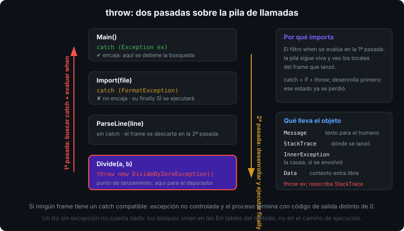

# Excepciones: `try`, `catch`, `finally` y filtros `when`

## 🎯 Objetivos

Al finalizar este archivo, comprenderás:

- Qué es una excepción y cómo se propaga por la pila hasta encontrar un manejador
- La diferencia entre `throw;` y `throw ex;` y por qué una destruye información
- Para qué sirve un filtro `when` y en qué se diferencia de un `if` dentro del `catch`
- Cuándo `finally` y `using` garantizan la liberación de un recurso
- Cuándo NO usar excepciones: el patrón `TryXxx` y las guard clauses

## 📋 Conceptos clave

### 1. Una excepción es un objeto que viaja pila arriba

Cuando un método no puede cumplir su contrato, **lanza**: crea un objeto `Exception` y aborta la ejecución normal. El runtime busca un `catch` compatible recorriendo la pila de llamadas hacia atrás. Si no encuentra ninguno, el proceso termina.

```csharp
static decimal Divide(decimal a, decimal b)
{
    if (b == 0) throw new DivideByZeroException("El divisor no puede ser 0.");
    return a / b;
}
```



La información que lleva el objeto: `Message` (para el humano), `StackTrace` (dónde se lanzó), `InnerException` (la causa original si se envolvió) y `Data` (diccionario libre de contexto).

### 2. `try` / `catch` / `finally`

```csharp
try
{
    string content = File.ReadAllText(path);
    Console.WriteLine(content.Length);
}
catch (FileNotFoundException ex)          // el más específico primero
{
    Console.WriteLine($"No existe: {ex.FileName}");
}
catch (IOException ex)                    // el más general después
{
    Console.WriteLine($"Error de E/S: {ex.Message}");
}
finally
{
    Console.WriteLine("Se ejecuta siempre: haya excepción o no, haya return o no.");
}
```

El orden importa: los `catch` se evalúan de arriba abajo y el compilador rechaza poner una clase base antes de una derivada (error CS0160). `finally` se ejecuta también cuando el `try` hace `return`, y su código no debe lanzar: una excepción dentro de `finally` sustituye a la original y la pierde.

### 3. Filtros `when`: decidir sin capturar

```csharp
try { Process(order); }
catch (HttpRequestException ex) when (ex.StatusCode == HttpStatusCode.TooManyRequests)
{
    Retry(order);                          // solo el 429 se reintenta
}
catch (SqlException ex) when (IsTransient(ex) && attempts < 3)
{
    attempts++;
}
```

Diferencia con `catch (X ex) { if (...) throw; }`: el filtro se evalúa **antes** de desenrollar la pila (primera pasada). Si devuelve `false`, el `catch` no se entra, la pila queda intacta y el depurador se detiene en el punto original de lanzamiento. Con `if` + `throw;` la pila ya se desenrolló y se pierde el estado local de los frames intermedios.

Truco útil para trazar sin capturar (el filtro siempre devuelve `false`):

```csharp
catch (Exception ex) when (Log(ex)) { }   // static bool Log(Exception e) { /* ... */ return false; }
```

### 4. `throw;` vs `throw ex;` vs envolver

```csharp
catch (IOException ex)
{
    throw;                                              // ✅ re-lanza: conserva el StackTrace original
}
catch (IOException ex)
{
    throw ex;                                           // ❌ reinicia el StackTrace en esta línea
}
catch (IOException ex)
{
    throw new CatalogLoadException(path, ex);           // ✅ envuelve: la causa queda en InnerException
}
```

Regla: si no aportas contexto, no captures. Si aportas contexto, **envuelve** conservando `InnerException`.

### 5. Guard clauses y `throw` expression

La BCL trae ayudantes que lanzan la excepción correcta con el nombre del parámetro:

```csharp
public static Reservation Create(string code, int nights, DateOnly start)
{
    ArgumentException.ThrowIfNullOrWhiteSpace(code);            // ArgumentException
    ArgumentOutOfRangeException.ThrowIfNegativeOrZero(nights);  // ArgumentOutOfRangeException
    ArgumentNullException.ThrowIfNull(code);                    // ArgumentNullException
    ObjectDisposedException.ThrowIf(_disposed, this);
    // ...
}
```

`throw` también es una **expresión** (C# 7), así que cabe en el lado derecho de `??`, `?:` y en un cuerpo de expresión:

```csharp
_name = name ?? throw new ArgumentNullException(nameof(name));
public string Describe() => _items.Count > 0 ? Summary() : throw new InvalidOperationException("Catálogo vacío.");
```

### 6. Cuándo NO usar excepciones: el patrón `TryXxx`

Una excepción señala algo **excepcional**, no un flujo esperado. Que el usuario escriba "abc" donde va un número es esperado:

```csharp
// ❌ excepción como control de flujo: lenta y ruidosa
try { quantity = int.Parse(input); } catch (FormatException) { quantity = 0; }

// ✅ patrón TryXxx: devuelve bool, nunca lanza, entrega el valor por out
if (!int.TryParse(input, out int quantity)) quantity = 0;
```

Tus propias APIs pueden ofrecer ambas caras: `Parse` que lanza y `TryParse` que no (como hizo `TryParseLine` en la semana 02).

### 7. `using`: liberación garantizada

Todo lo que implementa `IDisposable` se libera con `using`, que el compilador traduce a `try/finally`:

```csharp
using var reader = new StreamReader(path);       // using declaration: libera al salir del ámbito
string? first = reader.ReadLine();
```

Detalle en la semana 04: quién implementa `IDisposable` y cómo. Aquí basta saber que **un stream sin `using` es un fichero bloqueado**.

## 🔬 Bajo el capó

`throw` compila a la instrucción IL `throw`; el bloque protegido se registra en las **EH tables** del método (no hay coste en tiempo de ejecución mientras no se lance nada: un `try` vacío es gratis). Cuando algo se lanza, el runtime hace **dos pasadas**: la primera recorre la pila buscando un manejador y evalúa los filtros `when` sin tocar los frames; la segunda desenrolla ejecutando los `finally` de cada frame hasta el `catch` elegido. Por eso un filtro ve la pila viva y un `if` dentro del `catch` no.

El coste real de una excepción está en construir el `StackTrace` y en el salto del runtime: del orden de microsegundos, miles de veces más que un `if`. Irrelevante una vez por petición fallida; devastador en un bucle de un millón de líneas de un CSV. `ExceptionDispatchInfo.Capture(ex).Throw()` permite re-lanzar desde otro hilo o método conservando la traza original — lo verás en async (semana 10).

## ⚠️ Errores comunes

- `catch (Exception) { }` vacío: el error desaparece y el bug aparece tres capas más arriba.
- `throw ex;` en vez de `throw;`.
- Capturar `Exception` cuando solo esperabas `FormatException`: te tragas un `OutOfMemoryException`.
- Usar excepciones para validar entrada de usuario en bucle.
- `return` dentro de `finally` (no compila) o lanzar dentro de `finally` (pierde la excepción original).

## 📚 Recursos adicionales

- [Excepciones y manejo de excepciones](https://learn.microsoft.com/dotnet/csharp/fundamentals/exceptions/)
- [Mejores prácticas con excepciones](https://learn.microsoft.com/dotnet/standard/exceptions/best-practices-for-exceptions)
- [`when` (filtro de excepción)](https://learn.microsoft.com/dotnet/csharp/language-reference/statements/exception-handling-statements#exception-filters)
- [Guard clauses de la BCL: `ArgumentNullException.ThrowIfNull`](https://learn.microsoft.com/dotnet/api/system.argumentnullexception.throwifnull)

## ✅ Checklist de verificación

- [ ] Explico las dos pasadas del runtime y por qué un filtro `when` ve la pila intacta
- [ ] Distingo `throw;`, `throw ex;` y envolver en `InnerException`
- [ ] Ordeno los `catch` de más específico a más general sin provocar CS0160
- [ ] Elijo `TryXxx` en vez de `try/catch` cuando el fallo es esperado
- [ ] Nunca dejo un `catch` vacío ni abro un stream sin `using`
