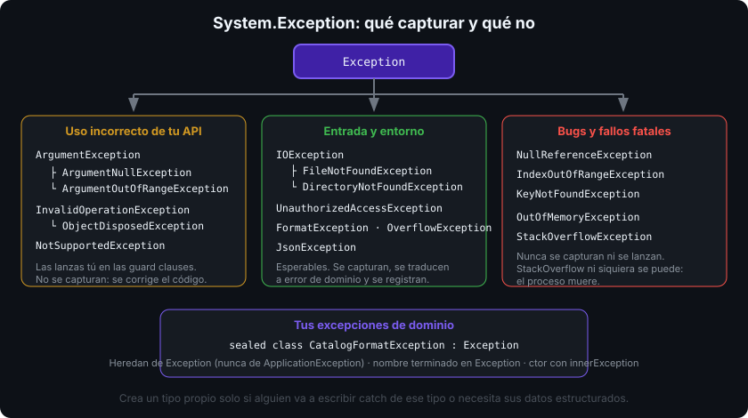

# Excepciones personalizadas y jerarquía de `Exception`

## 🎯 Objetivos

Al finalizar este archivo, comprenderás:

- La jerarquía de `System.Exception` y qué tipos de la BCL reutilizar antes de inventar uno
- Cómo diseñar una excepción propia: nombre, constructores, propiedades de contexto
- Cuándo crear un tipo nuevo y cuándo es ruido
- Qué son `InnerException` y `AggregateException` y cómo leer una cadena de causas
- Qué excepciones nunca debes capturar ni lanzar

## 📋 Conceptos clave

### 1. La jerarquía

Todo hereda de `Exception`. Las ramas que importan:

```
Exception
├── SystemException            (lanzadas por el runtime)
│   ├── ArgumentException → ArgumentNullException, ArgumentOutOfRangeException
│   ├── InvalidOperationException → ObjectDisposedException
│   ├── NullReferenceException · IndexOutOfRangeException   ← bugs, no los captures
│   ├── FormatException · OverflowException
│   └── IOException → FileNotFoundException, DirectoryNotFoundException, EndOfStreamException
├── ApplicationException       (histórica; NO heredes de aquí)
└── Tus excepciones            (heredan directamente de Exception)
```



`OutOfMemoryException` y `StackOverflowException` son fatales: la segunda ni siquiera se puede capturar, el proceso muere.

### 2. Reutiliza antes de crear

| Situación | Tipo de la BCL |
|-----------|----------------|
| Argumento `null` | `ArgumentNullException` |
| Argumento fuera de rango | `ArgumentOutOfRangeException` |
| Argumento con formato o valor inválido | `ArgumentException` |
| El objeto no está en un estado válido para esa operación | `InvalidOperationException` |
| Método aún no implementado | `NotImplementedException` |
| La operación no tiene sentido para este tipo | `NotSupportedException` |
| Texto no parseable | `FormatException` |
| Fichero/directorio ausente | `FileNotFoundException` / `DirectoryNotFoundException` |

### 3. Cuándo crear la tuya

Crea un tipo propio **solo si quien llama va a tratar ese caso de forma distinta** o necesita datos estructurados del error. Si nadie va a escribir `catch (MiExcepcion)`, un `InvalidOperationException` con un buen mensaje basta.

```csharp
/// <summary>Se lanza cuando una línea del catálogo no cumple el formato esperado.</summary>
public sealed class CatalogFormatException : Exception
{
    public CatalogFormatException(int lineNumber, string line, string reason)
        : base($"Línea {lineNumber} inválida: {reason}")
    {
        LineNumber = lineNumber;
        Line = line;
    }

    public CatalogFormatException(string message, Exception innerException)
        : base(message, innerException) { }

    public int LineNumber { get; }
    public string Line { get; init; } = "";
}
```

Reglas de diseño:

- El nombre **termina en `Exception`** y describe la causa, no el síntoma.
- `sealed` salvo que diseñes una jerarquía propia (una base `CatalogException` y derivadas tiene sentido cuando quien llama quiere capturar todo el grupo).
- Ofrece al menos un constructor con `(string message, Exception innerException)`.
- Las propiedades de contexto son `get`/`init`, nunca mutables: la excepción es un dato de solo lectura.
- No pongas lógica pesada en el constructor: se ejecuta en el peor momento posible.

### 4. Envolver: `InnerException`

Una capa baja lanza un error técnico; la capa de arriba lo traduce a un error de dominio **sin perder la causa**:

```csharp
try
{
    string json = File.ReadAllText(path);
    return JsonSerializer.Deserialize<Catalog>(json) ?? throw new CatalogLoadException(path, null);
}
catch (Exception ex) when (ex is IOException or JsonException)
{
    throw new CatalogLoadException(path, ex);   // ex queda accesible en InnerException
}
```

Para leer la cadena completa: `ex.ToString()` la imprime entera, y `ex.GetBaseException()` devuelve la causa más profunda. El patrón `when (ex is A or B)` captura dos tipos hermanos sin duplicar el bloque.

### 5. `AggregateException`

Cuando varias operaciones fallan a la vez (tareas en paralelo, `Task.WhenAll`), .NET agrupa las excepciones:

```csharp
try { Parallel.ForEach(files, Import); }
catch (AggregateException agg)
{
    foreach (Exception inner in agg.Flatten().InnerExceptions)
        Console.WriteLine(inner.Message);
}
```

`Flatten()` aplana los agregados anidados. Lo verás a fondo en las semanas 10 y 15.

### 6. Qué nunca hacer

```csharp
throw new NullReferenceException();   // ❌ es un bug del runtime, no un mensaje tuyo
throw new Exception("algo falló");    // ❌ obliga a capturar Exception para tratarlo
catch (IndexOutOfRangeException) { }  // ❌ tapa un bug de índice en vez de arreglarlo
catch (StackOverflowException) { }    // ❌ no se puede capturar: el proceso muere
```

Y nunca uses el mensaje de la excepción como valor de negocio (`if (ex.Message.Contains("duplicad"))`): los mensajes cambian con la cultura y la versión. Para eso están el tipo y las propiedades.

## 🔬 Bajo el capó

Una excepción es un objeto normal del heap; su `StackTrace` no se rellena al construirla, sino cuando el runtime la lanza (por eso `new MiException()` guardada en un campo tiene traza vacía, y por eso re-lanzar con `throw ex;` la reescribe). El campo `_stackTraceString` se materializa a texto solo cuando alguien lee la propiedad, usando los **portable PDB**: sin PDB junto al ensamblado ves nombres de método pero no fichero ni línea — motivo por el que se publican los `.pdb` incluso en Release.

`ExceptionDispatchInfo.Capture(ex).Throw()` guarda la traza acumulada en un campo aparte (`_remoteStackTraceString`) y la vuelve a pegar delante de la nueva: es el mecanismo con el que `await` te devuelve la excepción de otro hilo con la pila original intacta.

## ⚠️ Errores comunes

- Heredar de `ApplicationException` (recomendación abandonada hace más de una década).
- Crear una excepción por cada mensaje de error posible: acabas con 40 tipos que nadie captura.
- Perder la causa: `catch (Exception ex) { throw new MyException("falló"); }` sin pasar `ex`.
- Excepciones con propiedades mutables que alguien modifica al vuelo.
- Capturar `Exception` en una capa baja "por si acaso" en vez de dejarla subir.

## 📚 Recursos adicionales

- [Crear y lanzar excepciones](https://learn.microsoft.com/dotnet/csharp/fundamentals/exceptions/creating-and-throwing-exceptions)
- [Diseño de excepciones personalizadas (guía de diseño de la BCL)](https://learn.microsoft.com/dotnet/standard/design-guidelines/designing-custom-exceptions)
- [Jerarquía de `System.Exception`](https://learn.microsoft.com/dotnet/api/system.exception)
- [`ExceptionDispatchInfo`](https://learn.microsoft.com/dotnet/api/system.runtime.exceptionservices.exceptiondispatchinfo)

## ✅ Checklist de verificación

- [ ] Elijo el tipo de la BCL adecuado antes de crear uno propio
- [ ] Mi excepción termina en `Exception`, es `sealed` y admite `innerException`
- [ ] Nunca lanzo `Exception`, `NullReferenceException` ni `IndexOutOfRangeException`
- [ ] Sé leer una cadena de `InnerException` y aplanar un `AggregateException`
- [ ] Decido por tipo y propiedades, nunca por el texto de `Message`
