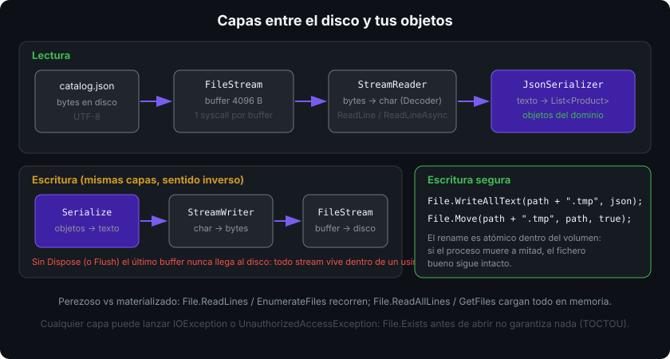

# `System.IO`: rutas, ficheros y streams

## 🎯 Objetivos

Al finalizar este archivo, comprenderás:

- Por qué se construyen rutas con `Path.Combine` y nunca concatenando `"/"`
- Qué ofrecen `File` y `Directory` para operaciones de una línea
- Qué es un `Stream`, qué lo envuelve (`StreamReader`/`StreamWriter`) y por qué hay buffers
- Cómo leer ficheros grandes sin cargarlos enteros en memoria
- Cómo escribir de forma segura: fichero temporal + `File.Move` atómico
- Qué excepciones de E/S hay que esperar siempre

## 📋 Conceptos clave

### 1. Rutas: `Path`, nunca strings a mano

```csharp
string dir = Path.Combine(AppContext.BaseDirectory, "data");   // separador correcto por SO
string file = Path.Combine(dir, "catalog.json");
Path.GetFileName(file);            // "catalog.json"
Path.GetFileNameWithoutExtension(file); // "catalog"
Path.GetExtension(file);           // ".json"
Path.GetDirectoryName(file);       // ".../data"
Path.GetFullPath("./x.txt");       // absoluta, resolviendo . y ..
Path.IsPathRooted(file);           // true
Path.GetTempFileName();            // crea un fichero temporal vacío y devuelve su ruta
```

`Path.Combine` descarta lo anterior si un segmento es absoluto: `Path.Combine("/a", "/b")` es `"/b"`. En Linux el separador es `/`, en Windows `\`; `Path.DirectorySeparatorChar` lo expone. El directorio de trabajo (`Directory.GetCurrentDirectory()`) **no** es necesariamente el del ejecutable (`AppContext.BaseDirectory`): en `dotnet run` coinciden, publicado no.

### 2. `File` y `Directory`: la vía rápida

```csharp
File.Exists(file);
File.WriteAllText(file, json);                        // crea o sobrescribe
File.AppendAllLines(log, ["línea 1", "línea 2"]);
string text = File.ReadAllText(file);
string[] lines = File.ReadAllLines(file);
File.Delete(file);                                    // no lanza si no existe
File.Move(src, dst, overwrite: true);                 // atómico dentro del mismo volumen
File.Copy(src, dst, overwrite: true);

Directory.CreateDirectory(dir);                       // idempotente: no lanza si ya existe
Directory.EnumerateFiles(dir, "*.json", SearchOption.AllDirectories);
new FileInfo(file).Length;                            // bytes
new DirectoryInfo(dir).GetFiles();
```

`EnumerateFiles` es perezoso (devuelve según recorre); `GetFiles` materializa un array completo. Con un directorio de 200 000 ficheros la diferencia se nota.

Todos tienen versión asíncrona: `File.ReadAllTextAsync`, `File.WriteAllTextAsync`, `File.ReadAllLinesAsync` — preferidas en cuanto haya `async` (semana 10).

### 3. `Stream`: la abstracción común

Un `Stream` es una secuencia de **bytes** con `Read`, `Write`, `Seek`, `Flush` y `Dispose`. Da igual de dónde vengan: fichero, red, memoria o compresión.



```csharp
using FileStream fs = File.OpenRead(path);            // bytes
using var reader = new StreamReader(fs);              // bytes → texto (UTF-8 por defecto)
string? line = reader.ReadLine();
```

Las capas se envuelven: `FileStream` (bytes del disco) → `GZipStream` (descompresión) → `StreamReader` (decodifica a `char`). Cada capa solo entiende a su vecina.

Tipos frecuentes: `FileStream`, `MemoryStream` (buffer en memoria, ideal para tests), `NetworkStream`, `GZipStream`/`BrotliStream`, `CryptoStream`.

### 4. Leer grande sin reventar la memoria

```csharp
// ❌ un fichero de 2 GB entero en el heap
string all = File.ReadAllText(path);

// ✅ línea a línea, perezoso
foreach (string line in File.ReadLines(path))
    Process(line);

// ✅ control total del buffer
using var reader = new StreamReader(path, Encoding.UTF8, detectEncodingFromByteOrderMarks: true);
while (await reader.ReadLineAsync() is { } line)
    Process(line);
```

`File.ReadLines` (perezoso) frente a `File.ReadAllLines` (array completo) es la misma diferencia que `EnumerateFiles` frente a `GetFiles`.

### 5. Escribir de forma segura

Si el proceso muere a mitad de un `WriteAllText`, el fichero queda truncado. El patrón seguro es escribir aparte y renombrar (el rename dentro del mismo volumen es atómico):

```csharp
string temp = path + ".tmp";
File.WriteAllText(temp, json);
File.Move(temp, path, overwrite: true);     // o File.Replace(temp, path, backupPath)
```

Y para controlar creación, acceso y uso compartido:

```csharp
using var fs = new FileStream(path, FileMode.CreateNew, FileAccess.Write, FileShare.None);
```

| `FileMode` | Efecto |
|------------|--------|
| `CreateNew` | crea; lanza `IOException` si ya existe |
| `Create` | crea o **trunca** el existente |
| `Open` | abre; lanza `FileNotFoundException` si falta |
| `OpenOrCreate` | abre o crea |
| `Append` | abre al final; solo escritura |

`FileShare` decide qué pueden hacer otros procesos mientras tanto: `None` bloquea el fichero, `Read` permite que otros lean.

### 6. Las excepciones que hay que esperar

`FileNotFoundException`, `DirectoryNotFoundException`, `UnauthorizedAccessException` (permisos o es un directorio), `PathTooLongException`, `IOException` (base de todas ellas y del "fichero en uso"). Todas derivan de `IOException` salvo `UnauthorizedAccessException`, que deriva de `SystemException` — detalle fácil de olvidar al escribir el `catch`.

`File.Exists(path)` antes de abrir **no garantiza nada**: entre la comprobación y la apertura el fichero puede desaparecer (condición de carrera TOCTOU). Se usa para dar un mensaje amable, pero el `try/catch` sigue siendo obligatorio.

## 🔬 Bajo el capó

`FileStream` mantiene un buffer gestionado (4096 bytes por defecto) para no hacer una syscall por byte: `Write` copia al buffer y solo llama al sistema operativo cuando se llena o al hacer `Flush`/`Dispose`. Por eso un stream sin `Dispose` puede dejar datos sin escribir en disco. En .NET 6+ la implementación (`net6.0`+, "FileStream strategy") usa E/S asíncrona real del SO cuando se abre con `useAsync: true`, evitando bloquear un hilo del pool.

`StreamReader` decodifica con un `Decoder` con estado: un carácter UTF-8 multibyte partido entre dos lecturas se reconstruye correctamente. Su valor por defecto es UTF-8 sin BOM; `File.WriteAllText` escribe UTF-8 **sin** BOM, y `detectEncodingFromByteOrderMarks` permite leer ficheros ajenos que sí lo llevan. El BOM mal gestionado es la causa clásica del `JsonException` "'0xEF' is an invalid start of a value" que verás en el archivo 05.

## ⚠️ Errores comunes

- Concatenar rutas con `+ "/" +`: rompe en Windows y con separadores duplicados.
- Abrir un stream sin `using`: fichero bloqueado y datos sin escribir.
- `ReadAllText` sobre ficheros de log de gigabytes.
- Asumir que el directorio de trabajo es el del ejecutable.
- Sobrescribir el fichero bueno con una escritura que puede fallar a mitad.
- Capturar solo `FileNotFoundException` y olvidar `UnauthorizedAccessException`.

## 📚 Recursos adicionales

- [E/S de ficheros y streams](https://learn.microsoft.com/dotnet/standard/io/)
- [`Path`](https://learn.microsoft.com/dotnet/api/system.io.path) · [`File`](https://learn.microsoft.com/dotnet/api/system.io.file) · [`FileStream`](https://learn.microsoft.com/dotnet/api/system.io.filestream)
- [Manejar errores de E/S en .NET](https://learn.microsoft.com/dotnet/standard/io/handling-io-errors)
- [FileStream en .NET 6: más rápido y fiable](https://devblogs.microsoft.com/dotnet/file-io-improvements-in-dotnet-6/)

## ✅ Checklist de verificación

- [ ] Construyo todas las rutas con `Path.Combine`
- [ ] Sé qué capas hay entre el disco y un `string` que leo
- [ ] Uso `ReadLines`/`EnumerateFiles` (perezosos) con volúmenes grandes
- [ ] Escribo en `.tmp` y renombro para no corromper el fichero bueno
- [ ] Todo stream vive dentro de un `using`
- [ ] Mi `catch` cubre `IOException` **y** `UnauthorizedAccessException`
