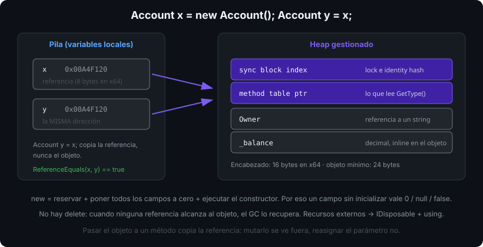

# Clases y objetos

## 🎯 Objetivos

Al finalizar este archivo, comprenderás:

- Qué distingue una clase (el plano) de un objeto (la instancia en memoria)
- Qué significa que una clase sea un **tipo por referencia** y qué copia una asignación
- Cómo se organiza un objeto en el heap y qué guarda la variable
- Qué hacen `this`, los niveles de accesibilidad y el `null` de una referencia
- Qué heredan todas las clases de `object` y cuándo hay que redefinirlo

## 📋 Conceptos clave

### 1. La clase describe, el objeto existe

```csharp
public class Account            // el plano: qué datos y qué operaciones hay
{
    private decimal _balance;   // campo: estado privado de cada instancia

    public string Owner { get; init; } = "";

    public void Deposit(decimal amount)
    {
        ArgumentOutOfRangeException.ThrowIfNegativeOrZero(amount);
        _balance += amount;
    }

    public decimal Balance => _balance;
}

var a = new Account { Owner = "Ada" };   // el objeto: existe en memoria, tiene estado propio
var b = new Account { Owner = "Linus" }; // otro objeto distinto, con su propio _balance
```

Una clase se escribe una vez; los objetos se crean tantas veces como haga falta y cada uno tiene **su copia del estado de instancia**.

### 2. Tipo por referencia: la variable no es el objeto

```csharp
Account x = new Account { Owner = "Ada" };
Account y = x;            // se copia la REFERENCIA, no el objeto
y.Deposit(100);
Console.WriteLine(x.Balance);   // 100: x e y apuntan al mismo objeto
Console.WriteLine(ReferenceEquals(x, y));  // True
```



Esto ya se vio en la semana 02 al pasar una `List<T>` a un método: el parámetro recibe una copia de la referencia, así que muta el mismo objeto, pero reasignar el parámetro no afecta al llamador.

### 3. Dónde vive cada cosa

La variable local `x` vive en la pila (o en un registro) y contiene una dirección; el objeto vive en el **heap gestionado** y lleva por delante un encabezado de objeto (sync block + puntero a su tabla de métodos). En x64 esos dos campos ocupan 16 bytes antes del primer campo tuyo. La semana 11 lo mide; aquí basta la idea: **crear un objeto no es gratis y el GC es quien lo limpia**.

Cuando nadie apunta ya a un objeto, pasa a ser recolectable. No hay `delete`, no hay destructor determinista: si el objeto tiene un recurso externo (fichero, socket) se implementa `IDisposable` y se usa `using`.

### 4. `null`: ausencia de objeto

```csharp
Account? maybe = null;          // con nullable enable, el ? es obligatorio para admitir null
Console.WriteLine(maybe?.Balance ?? 0);      // 0, sin NullReferenceException
ArgumentNullException.ThrowIfNull(maybe);     // guard clause en el borde
```

Con `<Nullable>enable</Nullable>`, `Account` **no** admite `null` y `Account?` sí; el compilador avisa si desreferencias sin comprobar. Las reglas completas llegan en la semana 09; la disciplina empieza hoy.

### 5. Accesibilidad

| Modificador | Visible desde |
|-------------|---------------|
| `private` | solo dentro del tipo (valor por defecto en miembros) |
| `protected` | el tipo y sus derivados |
| `internal` | el mismo ensamblado (valor por defecto en tipos) |
| `protected internal` | derivados **o** mismo ensamblado |
| `private protected` | derivados **dentro** del mismo ensamblado |
| `public` | todo el mundo |

Regla práctica: campos siempre `private`; expón estado con propiedades; el tipo más cerrado que funcione.

### 6. `this`

```csharp
public sealed class Transfer
{
    private readonly decimal _amount;

    public Transfer(decimal amount)
    {
        _amount = amount;                 // sin ambigüedad, no hace falta this
    }

    public Transfer Doubled() => new Transfer(this._amount * 2);   // this = la instancia actual
}
```

`this` referencia al objeto sobre el que se está ejecutando el método. Se usa para desambiguar, para pasarse a sí mismo y en los constructores encadenados (`: this(...)`, archivo 02).

### 7. Todo hereda de `object`

Cualquier clase, sin declararlo, hereda cuatro miembros virtuales:

```csharp
public override string ToString() => $"{Owner}: {Balance:N2}";   // texto legible
public override bool Equals(object? obj) => obj is Account a && a.Owner == Owner;
public override int GetHashCode() => Owner.GetHashCode();
// GetType() no es virtual: siempre devuelve el tipo real en tiempo de ejecución
```

Por defecto `Equals` compara **identidad de referencia** y `ToString()` devuelve el nombre del tipo. Si tu objeto representa un **valor** (un dinero, una coordenada, un ISBN), redefine `Equals` y `GetHashCode` **juntos** — el contrato de la semana 02 sigue vigente: objetos iguales deben dar el mismo hash. En la semana 05 verás que `record` genera todo esto solo.

## 🔬 Bajo el capó

`new Account()` compila a IL `newobj`, que hace tres cosas: reserva memoria en el heap (normalmente un simple avance de puntero en la generación 0), pone a cero todos los campos y llama al constructor. Por eso un campo no inicializado vale `0`/`null`/`false` y nunca basura.

Los 16 bytes de encabezado en x64 son el **sync block index** (usado por `lock` y por el hash de identidad) y el **method table pointer**, que apunta a la estructura que describe el tipo: sus campos, su tabla de métodos virtuales y su información de GC. `GetType()` lee exactamente ese puntero, y por eso no se puede falsear. El tamaño mínimo de un objeto es 24 bytes en x64 aunque no tenga ni un campo.

## ⚠️ Errores comunes

- Creer que asignar una variable de clase copia el objeto.
- Campos `public` "para ir rápido": rompen el encapsulamiento y ya no puedes validar.
- Redefinir `Equals` sin redefinir `GetHashCode` (o al revés).
- Comparar objetos con `==` esperando igualdad por valor cuando no se ha sobrecargado.
- Suponer que un objeto se libera "al salir del método": lo libera el GC cuando quiere.

## 📚 Recursos adicionales

- [Clases (guía de C#)](https://learn.microsoft.com/dotnet/csharp/fundamentals/types/classes)
- [Tipos por referencia](https://learn.microsoft.com/dotnet/csharp/language-reference/keywords/reference-types)
- [Niveles de accesibilidad](https://learn.microsoft.com/dotnet/csharp/language-reference/keywords/accessibility-levels)
- [`System.Object`](https://learn.microsoft.com/dotnet/api/system.object)

## ✅ Checklist de verificación

- [ ] Explico qué guarda una variable de clase y qué copia una asignación
- [ ] Describo el encabezado de un objeto y quién lo libera
- [ ] Elijo el modificador de accesibilidad más cerrado que funcione
- [ ] Sé cuándo redefinir `ToString`, `Equals` y `GetHashCode`
- [ ] Trato `null` con `?`, `?.` y guard clauses en vez de confiar
