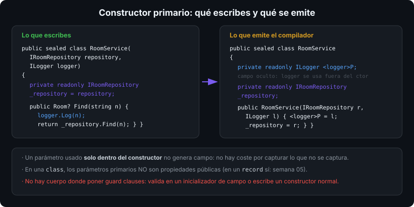

# Propiedades y constructores

## 🎯 Objetivos

Al finalizar este archivo, comprenderás:

- La diferencia entre campo y propiedad, y por qué el estado público siempre es propiedad
- Los accesores `get`/`set`/`init`, el modificador `required` y la palabra clave `field` (C# 14)
- Cómo se encadenan constructores y en qué orden se inicializa un objeto
- Qué genera un **constructor primario** y cuándo usarlo
- Inicializadores de objeto y de colección, y qué garantías dan (y cuáles no)

## 📋 Conceptos clave

### 1. Campo vs propiedad

```csharp
public sealed class Room
{
    private readonly List<string> _guests = [];   // campo: privado, estado interno
    public int Number { get; init; }              // propiedad autoimplementada
    public IReadOnlyList<string> Guests => _guests; // propiedad calculada (solo get)
}
```

Una propiedad es un par de métodos (`get_Number`/`set_Number`) con sintaxis de campo: permite validar, calcular, registrar o cambiar la implementación **sin romper a quien la usa**. Un campo público no permite nada de eso, y cambiarlo a propiedad más tarde es un cambio binario incompatible.

### 2. Accesores: `get`, `set`, `init`

```csharp
public sealed class Booking
{
    public string Code { get; init; } = "";       // solo en la construcción: inmutable después
    public int Nights { get; set; }               // lectura y escritura
    public decimal Total { get; private set; }    // escritura solo desde dentro
    public bool IsLong => Nights > 7;             // calculada, sin almacenamiento
}
```

`init` permite asignar en el inicializador de objeto y **prohíbe** cualquier cambio posterior: inmutabilidad sin renunciar a la sintaxis cómoda.

### 3. `required`: el compilador exige el valor

```csharp
public sealed class Guest
{
    public required string Name { get; init; }
    public required string Email { get; init; }
    public string? Phone { get; init; }
}

var g = new Guest { Name = "Ada", Email = "ada@example.com" };   // ok
// var bad = new Guest { Name = "Ada" };   // error CS9035: falta Email
```

`required` sustituye al constructor con ocho parámetros: la comprobación es en compilación y el objeto no puede existir a medio construir.

### 4. `field`: cuerpo propio sin declarar el campo (C# 14)

```csharp
public sealed class Product
{
    public required string Name
    {
        get => field;
        set => field = value.Trim();          // validación sin declarar _name a mano
    }

    public decimal Price
    {
        get;
        set => field = value >= 0 ? value : throw new ArgumentOutOfRangeException(nameof(value));
    }
}
```

`field` es el campo de respaldo que el compilador ya generaba, ahora accesible desde el cuerpo del accesor. Elimina el ruido de declarar `private string _name;` solo para poder validar. Si tu clase tiene un campo llamado `field`, renómbralo o usa `@field`.

### 5. Constructores y encadenamiento

```csharp
public sealed class Reservation
{
    public Reservation(string code, int nights, decimal rate)
    {
        ArgumentException.ThrowIfNullOrWhiteSpace(code);
        ArgumentOutOfRangeException.ThrowIfNegativeOrZero(nights);
        Code = code;
        Nights = nights;
        Rate = rate;
    }

    public Reservation(string code) : this(code, nights: 1, rate: 100m) { }  // delega: una sola validación

    public string Code { get; }
    public int Nights { get; }
    public decimal Rate { get; }
}
```

Orden de inicialización de una instancia: **inicializadores de campo → constructor de la base → cuerpo del constructor**. Por eso un método virtual llamado desde el constructor de la base puede ejecutarse cuando los campos de la derivada todavía están a cero (archivo 05).

Si no escribes ningún constructor, el compilador genera uno público sin parámetros. En cuanto escribes uno, deja de generarlo.

### 6. Constructor primario

```csharp
public sealed class RoomService(IRoomRepository repository, ILogger logger)
{
    private readonly IRoomRepository _repository = repository;   // captura explícita

    public Task<Room?> FindAsync(Guid id, CancellationToken ct)
    {
        logger.Log($"buscando {id}");        // uso directo del parámetro
        return _repository.GetAsync(id, ct);
    }
}
```

Los parámetros del constructor primario están **en ámbito en todo el cuerpo de la clase**. El compilador crea un campo privado oculto por cada parámetro que se use fuera del constructor.



Cuándo usarlo: servicios con dependencias inyectadas y clases pequeñas. Cuándo no: si necesitas validar los argumentos, hazlo en un campo (`private readonly X _x = Validate(x);`) o escribe un constructor normal; un constructor primario **no** tiene cuerpo donde poner guard clauses.

Ojo: en una `class`, los parámetros primarios **no** se convierten en propiedades públicas (a diferencia de un `record`, semana 05).

### 7. Inicializadores de objeto y de colección

```csharp
var hotel = new Hotel
{
    Name = "Central",
    Rooms =                                   // inicializador de colección
    {
        new Room { Number = 101 },
        new Room { Number = 102 },
    },
};
```

El inicializador de objeto se ejecuta **después** del constructor: primero existe el objeto, luego se asignan las propiedades. Por eso no puede garantizar invariantes — para eso están el constructor y `required`.

## 🔬 Bajo el capó

Una propiedad autoimplementada genera un campo `<Name>k__BackingField` (nombre no pronunciable desde C#) y dos métodos; el JIT los **inlinea**, así que `p.Name` cuesta lo mismo que leer un campo. `field` reutiliza ese mismo campo generado sin cambiar nada del coste.

`init` no es magia de runtime: es un `set` marcado con el modificador `modreq(IsExternalInit)`, y quien ignore ese modreq (otro lenguaje viejo) podría escribirlo — la garantía la da el compilador de C#, no el CLR. `required` se emite como el atributo `RequiredMemberAttribute` más `SetsRequiredMembers` en los constructores que sí inicializan todo; de nuevo, comprobación en compilación.

En el constructor primario, un parámetro solo usado dentro del constructor **no** genera campo: no hay coste por parámetros que no se capturan.

## ⚠️ Errores comunes

- Exponer campos públicos en vez de propiedades.
- Validar en el inicializador de objeto en vez de en el constructor (llega tarde).
- Llamar a un método `virtual` desde el constructor.
- Usar constructor primario cuando hacían falta guard clauses.
- Olvidar `= ""`/`= []` en propiedades no nullable sin `required`: warning de nullable.
- Creer que los parámetros primarios de una `class` son propiedades públicas.

## 📚 Recursos adicionales

- [Propiedades](https://learn.microsoft.com/dotnet/csharp/properties)
- [`init`](https://learn.microsoft.com/dotnet/csharp/language-reference/keywords/init) · [`required`](https://learn.microsoft.com/dotnet/csharp/language-reference/keywords/required)
- [La palabra clave `field` (C# 14)](https://learn.microsoft.com/dotnet/csharp/whats-new/csharp-14#the-field-keyword)
- [Constructores primarios](https://learn.microsoft.com/dotnet/csharp/whats-new/tutorials/primary-constructors)

## ✅ Checklist de verificación

- [ ] No expongo ningún campo público
- [ ] Uso `init` + `required` para estado inmutable obligatorio
- [ ] Valido en el constructor, nunca en el inicializador de objeto
- [ ] Explico el orden: inicializadores de campo → base → cuerpo
- [ ] Sé qué genera un constructor primario y cuándo no usarlo
