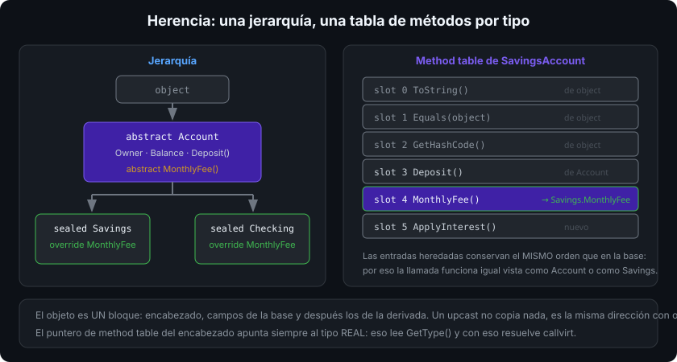
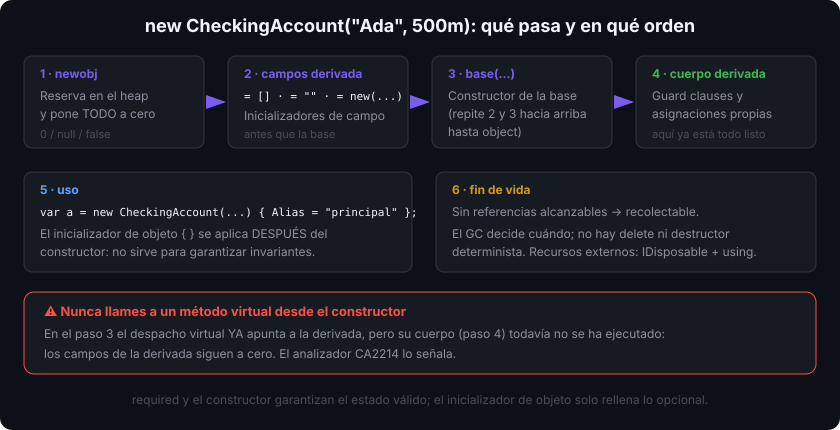

# Herencia

## 🎯 Objetivos

Al finalizar este archivo, comprenderás:

- Qué hereda una clase derivada y qué no
- Cómo se encadenan los constructores con `base(...)` y en qué orden se ejecuta todo
- Qué significa `protected` y por qué no es "público para la familia"
- Upcast, downcast seguro con `is`/`as` y el coste de equivocarse
- La diferencia entre **ocultar** (`new`) y **redefinir** (`override`)

## 📋 Conceptos clave

### 1. Derivar: reutilizar y especializar

```csharp
public class Account
{
    public Account(string owner) => Owner = owner;

    public string Owner { get; }
    public decimal Balance { get; protected set; }

    public void Deposit(decimal amount)
    {
        ArgumentOutOfRangeException.ThrowIfNegativeOrZero(amount);
        Balance += amount;
    }
}

public sealed class SavingsAccount : Account      // "es un" Account
{
    public SavingsAccount(string owner, decimal rate) : base(owner) => Rate = rate;

    public decimal Rate { get; }

    public void ApplyInterest() => Deposit(Balance * Rate);
}
```

La derivada hereda todos los miembros **salvo** constructores, finalizadores y miembros `private` (existen en memoria, pero no son accesibles). C# tiene **herencia simple**: una sola clase base, tantas interfaces como quieras (archivo 06).



### 2. `base(...)`: el constructor de la base va primero

```csharp
public sealed class CheckingAccount : Account
{
    public CheckingAccount(string owner, decimal overdraft) : base(owner)
    {
        // aquí la parte Account ya está construida
        Overdraft = overdraft;
    }

    public decimal Overdraft { get; }
}
```

Orden exacto al hacer `new CheckingAccount(...)`:

1. Inicializadores de campo de la **derivada**
2. Constructor de la **base** (que a su vez repite 1 y 2 hacia arriba)
3. Cuerpo del constructor de la derivada

Si la base no tiene constructor sin parámetros, `: base(...)` es obligatorio.



### 3. `protected`: para las derivadas, no para el mundo

```csharp
public class Account
{
    protected decimal ComputeFee() => Balance * 0.001m;   // visible en derivadas
    private decimal Secret() => 0;                        // ni siquiera en derivadas
}
```

`protected` amplía la superficie que debes mantener para siempre: cada miembro protegido es un contrato con las clases hijas, incluidas las que escriban otros. Empieza en `private` y sube solo cuando una derivada lo necesite de verdad.

### 4. Upcast, `is`, `as` y downcast

```csharp
Account account = new SavingsAccount("Ada", 0.02m);   // upcast: siempre seguro, implícito

if (account is SavingsAccount savings)                // patrón de tipo: comprueba y asigna
    savings.ApplyInterest();

var maybe = account as CheckingAccount;               // null si no es del tipo (no lanza)
var forced = (CheckingAccount)account;                // InvalidCastException si no lo es
```

Regla: `is` con patrón para el flujo normal; el cast explícito solo cuando un fallo sería un bug que quieres que explote. `account.GetType()` devuelve siempre el tipo **real** (`SavingsAccount`), independientemente del tipo de la variable.

Una cadena de `if (x is A) ... else if (x is B) ...` sobre tus propias clases es casi siempre una señal de que falta un método virtual (archivo 05).

### 5. Ocultar (`new`) vs redefinir (`override`)

```csharp
public class Base
{
    public virtual string Describe() => "base";
    public string Fixed() => "fijo";
}

public sealed class Derived : Base
{
    public override string Describe() => "derivada";     // ✅ redefine: el tipo real manda
    public new string Fixed() => "oculto";               // ⚠️ oculta: manda el tipo de la variable
}

Base b = new Derived();
b.Describe();   // "derivada"
b.Fixed();      // "fijo"  ← sorpresa: depende de cómo declaraste la variable
```

`new` no redefine nada: crea un miembro distinto que **tapa** el heredado. Casi siempre es un error; si el compilador te pide `new` (warning CS0108), párate: o querías `virtual`/`override`, o el nombre debería ser otro.

### 6. Diseñar para herencia (o prohibirla)

```csharp
public sealed class Invoice { }          // por defecto en el bootcamp: sellada
public abstract class Shape { }          // pensada para derivar (archivo 05)
```

Una clase no sellada es una promesa: cualquiera puede derivar y llamar a tus miembros protegidos en un orden que no previste. Por eso la regla del bootcamp es `sealed` salvo que la herencia sea parte del diseño — y además `sealed` permite al JIT convertir llamadas virtuales en directas.

Si hay herencia, documenta el contrato: qué método virtual debe llamar a `base`, qué invariante mantiene cada uno, qué no se debe llamar desde el constructor.

## 🔬 Bajo el capó

Un objeto de una clase derivada es **un solo bloque de memoria**: encabezado, campos de la base y a continuación los de la derivada. Por eso un upcast no copia nada: es la misma dirección interpretada con otro tipo estático. El puntero a la tabla de métodos del encabezado apunta a la del tipo real, y esa tabla empieza con las entradas heredadas (en el mismo orden que la base) seguidas de las nuevas: así una llamada virtual funciona igual visto como `Account` o como `SavingsAccount`.

`is` con patrón de tipo compila a `isinst` + comprobación de `null`; un cast explícito compila a `castclass`, que lanza si falla. Ambos recorren la jerarquía de tablas de métodos, y el JIT optimiza el caso de tipo sellado a una comparación directa de punteros.

## ⚠️ Errores comunes

- Heredar "para reutilizar código" cuando no hay una relación "es un" (archivo 07).
- Jerarquías de cuatro o cinco niveles: cada nivel multiplica el acoplamiento.
- `new` en vez de `override` (o dejar el warning CS0108 sin mirar).
- Llamar a un método virtual desde el constructor de la base.
- Olvidar `base.Metodo()` en una redefinición que debía extender, no sustituir.
- Campos `protected` mutables: la base pierde el control de su propia invariante.

## 📚 Recursos adicionales

- [Herencia en C#](https://learn.microsoft.com/dotnet/csharp/fundamentals/object-oriented/inheritance)
- [`base`](https://learn.microsoft.com/dotnet/csharp/language-reference/keywords/base)
- [Ocultar miembros heredados (`new`)](https://learn.microsoft.com/dotnet/csharp/language-reference/keywords/new-modifier)
- [Conversiones de tipo y `is`/`as`](https://learn.microsoft.com/dotnet/csharp/programming-guide/types/casting-and-type-conversions)

## ✅ Checklist de verificación

- [ ] Enumero el orden exacto de inicialización al construir una derivada
- [ ] Justifico cada miembro `protected` que expongo
- [ ] Uso `is` con patrón en vez de casts a ciegas
- [ ] Explico por qué `new` cambia el comportamiento según el tipo de la variable
- [ ] Sello por defecto y solo abro la herencia cuando forma parte del diseño
