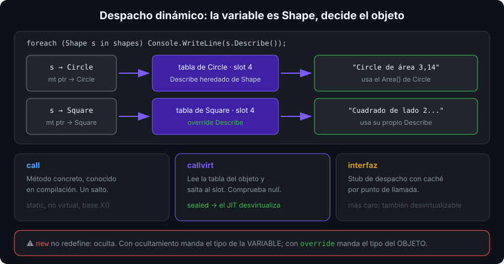

# Polimorfismo: `virtual`, `override`, `abstract`, `sealed`

## 🎯 Objetivos

Al finalizar este archivo, comprenderás:

- Qué es el despacho dinámico y cómo el runtime elige la implementación
- Cuándo una clase debe ser `abstract` y cuándo un método
- Para qué sirve `sealed` en un `override` y en una clase
- Cómo redefinir `ToString`, `Equals` y `GetHashCode` correctamente
- El patrón Template Method: la base fija el algoritmo, la derivada rellena huecos

## 📋 Conceptos clave

### 1. Despacho dinámico

```csharp
public abstract class Shape
{
    public abstract double Area();                       // sin cuerpo: obliga a la derivada
    public virtual string Describe() => $"{GetType().Name} de área {Area():F2}";
}

public sealed class Circle(double radius) : Shape
{
    public override double Area() => Math.PI * radius * radius;
}

public sealed class Square(double side) : Shape
{
    public override double Area() => side * side;
    public override string Describe() => $"Cuadrado de lado {side} y área {Area():F2}";
}

Shape[] shapes = [new Circle(1), new Square(2)];
foreach (Shape s in shapes) Console.WriteLine(s.Describe());   // cada una responde lo suyo
```

La variable es de tipo `Shape`, pero **el objeto decide**: eso es polimorfismo. Ese único bucle funciona con formas que todavía no existen, sin tocar una línea.



### 2. `abstract`: contrato sin implementación

```csharp
public abstract class Account(string owner)
{
    public string Owner { get; } = owner;
    public decimal Balance { get; protected set; }

    public abstract decimal MonthlyFee();          // cada tipo de cuenta la calcula a su manera
    protected abstract void OnWithdrawn(decimal amount);
}
```

Una clase `abstract` no se instancia (`new Account(...)` no compila) y puede mezclar miembros abstractos y concretos — esa es su ventaja frente a una interfaz: **aporta estado y comportamiento común**. Un miembro `abstract` obliga a toda derivada concreta a implementarlo.

### 3. `virtual` / `override` / `sealed override`

```csharp
public class Notification
{
    public virtual string Format() => "aviso";     // hay implementación, pero se puede redefinir
}

public class EmailNotification : Notification
{
    public sealed override string Format() => $"[email] {base.Format()}";  // aquí acaba la cadena
}
```

- `virtual`: hay comportamiento por defecto y las derivadas **pueden** cambiarlo.
- `override`: cambia el de la base; la firma debe coincidir exactamente.
- `base.Metodo()`: extiende en vez de sustituir.
- `sealed override`: redefine y **prohíbe** seguir redefiniendo más abajo; permite al JIT desvirtualizar.

### 4. Nunca llames a un virtual desde el constructor

```csharp
public abstract class Report
{
    protected Report() => Console.WriteLine(Title);   // ⚠️ Title se resuelve en la derivada…
    public abstract string Title { get; }
}

public sealed class Invoice : Report
{
    private readonly string _number = "F-001";        // …pero esto todavía no se ha asignado
    public override string Title => $"Factura {_number}";   // imprime "Factura " (null)
}
```

El constructor de la base se ejecuta **antes** que el cuerpo del de la derivada: el despacho virtual ya apunta a la derivada, pero sus campos aún están a cero. El analizador CA2214 lo señala.

### 5. Redefinir los miembros de `object`

```csharp
public sealed class Isbn : IEquatable<Isbn>
{
    public Isbn(string value) => Value = value;
    public string Value { get; }

    public override string ToString() => Value;
    public bool Equals(Isbn? other) => other is not null && Value == other.Value;
    public override bool Equals(object? obj) => Equals(obj as Isbn);
    public override int GetHashCode() => Value.GetHashCode(StringComparison.Ordinal);
}
```

Contrato obligatorio: si dos objetos son iguales, sus hash coinciden; el hash no puede cambiar mientras el objeto esté en un `Dictionary`/`HashSet`; `Equals` debe ser reflexivo, simétrico y transitivo. Implementar `IEquatable<T>` evita el boxing y la comprobación de tipo en colecciones genéricas. En la semana 05, `record` hará todo esto por ti.

### 6. Template Method: el algoritmo en la base

```csharp
public abstract class ImportJob
{
    public int Run(string path)                 // el esqueleto, fijo para todos
    {
        int imported = 0;
        foreach (string line in ReadLines(path))
            if (TryImport(line)) imported++;
        OnFinished(imported);
        return imported;
    }

    protected virtual IEnumerable<string> ReadLines(string path) => File.ReadLines(path);
    protected abstract bool TryImport(string line);      // el hueco obligatorio
    protected virtual void OnFinished(int imported) { }  // hueco opcional
}
```

El método público no es virtual: nadie puede romper el orden de los pasos. Las derivadas rellenan los huecos. Es el patrón donde la herencia sí aporta valor real.

### 7. `sealed` por defecto

Sellar una clase que no se diseñó para derivar evita sorpresas y **permite desvirtualizar**: el JIT sabe que no hay otra implementación posible y convierte la llamada virtual en directa (y quizá la inlinea). El coste de una llamada virtual es pequeño, pero impedir el inlining en un bucle caliente no lo es (semana 13).

## 🔬 Bajo el capó

Cada tipo tiene una **method table** con una sección de métodos virtuales. La derivada copia las entradas de la base en el mismo orden y sustituye las que redefine; añadir un método nuevo agrega una entrada al final. Por eso una llamada virtual es "leer el puntero de tabla del objeto, ir al slot N, saltar": coste constante, sin buscar por nombre.

En IL, `call` invoca un método concreto y `callvirt` consulta la tabla; el compilador de C# emite `callvirt` incluso para métodos no virtuales de tipos por referencia, porque además comprueba `null`. Con la clase sellada o el tipo exacto conocido, el JIT **desvirtualiza**: sustituye la búsqueda por una llamada directa y a menudo la inlinea. Las llamadas a través de interfaz son más caras (usan un mecanismo de despacho con caché) y también se pueden desvirtualizar si el JIT ve un único tipo posible.

## ⚠️ Errores comunes

- `abstract` cuando bastaba una interfaz (no había estado compartido) o al revés.
- Jerarquías donde la base conoce a sus derivadas (`if (this is Circle)`).
- Método virtual llamado desde el constructor.
- `Equals` redefinido sin `GetHashCode`, o un hash calculado sobre propiedades mutables.
- `override` que olvida `base.X()` y rompe una invariante que la base mantenía.
- Marcar todo `virtual` "por si acaso": cada punto virtual es una promesa pública.

## 📚 Recursos adicionales

- [Polimorfismo](https://learn.microsoft.com/dotnet/csharp/fundamentals/object-oriented/polymorphism)
- [`abstract`](https://learn.microsoft.com/dotnet/csharp/language-reference/keywords/abstract) · [`virtual`](https://learn.microsoft.com/dotnet/csharp/language-reference/keywords/virtual) · [`sealed`](https://learn.microsoft.com/dotnet/csharp/language-reference/keywords/sealed)
- [Guía: redefinir `Equals` y `GetHashCode`](https://learn.microsoft.com/dotnet/csharp/programming-guide/statements-expressions-operators/how-to-define-value-equality-for-a-type)
- [CA2214: no llamar a métodos redefinibles en constructores](https://learn.microsoft.com/dotnet/fundamentals/code-analysis/quality-rules/ca2214)

## ✅ Checklist de verificación

- [ ] Explico cómo elige el runtime la implementación de un método virtual
- [ ] Decido entre `abstract` e interfaz según si hay estado común
- [ ] Nunca llamo a un virtual desde un constructor
- [ ] Redefino `Equals`, `GetHashCode` y `ToString` juntos y con el contrato correcto
- [ ] Sello clases y `override` cuando la cadena debe terminar
