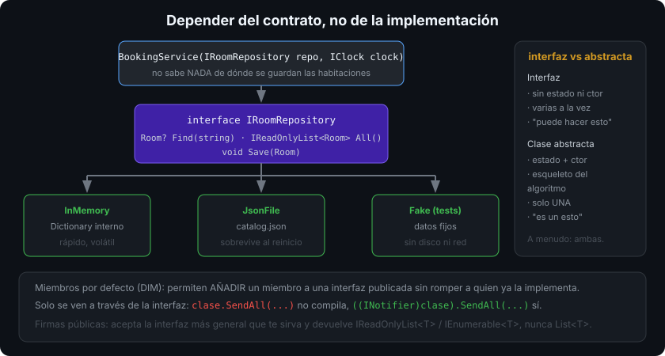

# Interfaces

## 🎯 Objetivos

Al finalizar este archivo, comprenderás:

- Qué es una interfaz y en qué se diferencia de una clase abstracta
- Implementación implícita y explícita, y cuándo hace falta la segunda
- Qué son los miembros de interfaz por defecto y qué problema resuelven
- Las interfaces de la BCL que aparecen cada día: `IEquatable<T>`, `IComparable<T>`, `IDisposable`, `IEnumerable<T>`
- Cómo una interfaz convierte una dependencia rígida en una sustituible

## 📋 Conceptos clave

### 1. Un contrato sin implementación

```csharp
public interface IRoomRepository
{
    Room? Find(string number);
    IReadOnlyList<Room> All();
    void Save(Room room);
}

public sealed class InMemoryRoomRepository : IRoomRepository
{
    private readonly Dictionary<string, Room> _rooms = new(StringComparer.OrdinalIgnoreCase);

    public Room? Find(string number) => _rooms.GetValueOrDefault(number);
    public IReadOnlyList<Room> All() => [.. _rooms.Values];
    public void Save(Room room) => _rooms[room.Number] = room;
}
```

Los miembros de una interfaz son públicos por definición y una clase puede implementar **tantas interfaces como quiera** (frente a una sola clase base).



### 2. Interfaz o clase abstracta

| | Interfaz | Clase abstracta |
|---|---|---|
| Estado (campos) | no | sí |
| Constructor | no | sí |
| Herencia múltiple | sí | no |
| Miembros por defecto | sí (DIM) | sí |
| Responde a… | "**puede hacer** esto" | "**es un** esto" |

Regla práctica: si necesitas compartir **estado** o el esqueleto de un algoritmo, clase abstracta; si defines una capacidad que tipos sin relación entre sí pueden ofrecer, interfaz. Y a menudo: interfaz para el contrato público + clase abstracta interna con lo común.

### 3. Implementación implícita vs explícita

```csharp
public sealed class Report : IDisposable, IAsyncDisposable
{
    public void Dispose() { }                       // implícita: también es parte de la API pública

    ValueTask IAsyncDisposable.DisposeAsync()       // explícita: solo visible a través de la interfaz
    {
        Dispose();
        return ValueTask.CompletedTask;
    }
}

var r = new Report();
r.Dispose();                       // ok
// r.DisposeAsync();               // no compila: hay que pasar por la interfaz
await ((IAsyncDisposable)r).DisposeAsync();
```

La implementación explícita sirve para: resolver dos interfaces con el mismo miembro, mantener fuera de la API pública un miembro que solo tiene sentido a través del contrato, y no contaminar IntelliSense con métodos de infraestructura.

### 4. Miembros por defecto (DIM, C# 8+)

```csharp
public interface INotifier
{
    void Send(string message);

    void SendAll(IEnumerable<string> messages)     // implementación por defecto
    {
        foreach (string m in messages) Send(m);
    }
}
```

Permiten **añadir** un miembro a una interfaz publicada sin romper a quien ya la implementa. No son herencia múltiple de estado: una interfaz sigue sin poder tener campos de instancia. Úsalos con moderación (evolución de API), no como forma de meter lógica en las interfaces.

Detalle: un miembro por defecto **no** es visible desde la clase, solo a través de la interfaz — si la clase no lo implementa, `clase.SendAll(...)` no compila, `((INotifier)clase).SendAll(...)` sí.

### 5. Las interfaces de la BCL que usarás siempre

```csharp
public sealed class Money : IEquatable<Money>, IComparable<Money>, IFormattable
{
    public Money(decimal amount) => Amount = amount;
    public decimal Amount { get; }

    public bool Equals(Money? other) => other is not null && Amount == other.Amount;
    public override bool Equals(object? obj) => Equals(obj as Money);
    public override int GetHashCode() => Amount.GetHashCode();
    public int CompareTo(Money? other) => other is null ? 1 : Amount.CompareTo(other.Amount);
    public string ToString(string? format, IFormatProvider? provider) => Amount.ToString(format, provider);
    public override string ToString() => ToString("N2", CultureInfo.CurrentCulture);
}
```

- `IEquatable<T>`: igualdad sin boxing; la usan `Dictionary`, `HashSet`, `List.Contains`.
- `IComparable<T>`: orden natural; la usan `Sort` y `SortedSet`. Alternativa sin tocar el tipo: pasar un `IComparer<T>`.
- `IDisposable` / `IAsyncDisposable`: liberar recursos con `using` / `await using` (semana 03).
- `IEnumerable<T>`: ser recorrible con `foreach` y por todo LINQ (semana 08).
- `IFormattable`: participar en el formateo con cultura (semana 02).

### 6. Programar contra la interfaz

```csharp
public sealed class BookingService(IRoomRepository repository, IClock clock)
{
    public Booking Reserve(string roomNumber, int nights)
    {
        Room room = repository.Find(roomNumber) ?? throw new RoomNotFoundException(roomNumber);
        return new Booking(room, clock.Now, nights);
    }
}
```

El servicio no sabe si el repositorio guarda en memoria, en JSON o en PostgreSQL; ni si el reloj es el del sistema o uno fijo del test. Eso es lo que hace testeable el código y lo que permite cambiar la implementación sin tocar la lógica: la base de SOLID (semana 06) y de la inyección de dependencias (semana 16).

Corolario: devuelve interfaces (`IReadOnlyList<T>`, `IEnumerable<T>`) en las firmas públicas y acepta la interfaz más general que te sirva.

### 7. Lo que llega después

- **Miembros estáticos abstractos** (`static abstract`, C# 11): permiten exigir `Parse`, `Zero` u operadores a un tipo genérico; son la base de las **matemáticas genéricas** (`INumber<T>`) que verás en la semana 05.
- **Varianza** (`in`/`out`): por qué `IEnumerable<string>` sirve donde se espera `IEnumerable<object>` — también semana 05.

## 🔬 Bajo el capó

Una llamada por interfaz no puede usar un índice fijo de tabla de métodos: dos clases sin relación implementan el mismo contrato en posiciones distintas. El CLR resuelve con un **interface dispatch stub** y una caché por punto de llamada: la primera llamada hace el trabajo de resolución, las siguientes saltan directas mientras el tipo no cambie (monomórfico). Sigue siendo más caro que una llamada directa, y por eso el JIT intenta desvirtualizar cuando ve un solo tipo posible — otra razón para sellar las implementaciones.

Los miembros por defecto se emiten como métodos con cuerpo **en la propia interfaz** y se invocan con `callvirt` sobre el tipo de interfaz; por eso no aparecen en la superficie pública de la clase. Y las interfaces genéricas con varianza llevan las marcas `in`/`out` en los metadatos, que el runtime comprueba en los casts.

## ⚠️ Errores comunes

- Una interfaz por clase, con un único implementador y el mismo nombre con `I` delante: abstracción vacía.
- Interfaces enormes: quien implemente necesita cumplirlo todo (principio ISP, semana 06).
- Usar DIM para meter lógica de negocio en la interfaz.
- Exponer `List<T>` en vez de `IReadOnlyList<T>` en una firma pública.
- Implementar `IDisposable` sin que haya nada que liberar.
- Olvidar que un miembro por defecto no se ve desde la clase.

## 📚 Recursos adicionales

- [Interfaces](https://learn.microsoft.com/dotnet/csharp/fundamentals/types/interfaces)
- [Implementación explícita](https://learn.microsoft.com/dotnet/csharp/programming-guide/interfaces/explicit-interface-implementation)
- [Miembros de interfaz por defecto](https://learn.microsoft.com/dotnet/csharp/whats-new/tutorials/default-interface-methods-versions)
- [`IEquatable<T>`](https://learn.microsoft.com/dotnet/api/system.iequatable-1) · [`IComparable<T>`](https://learn.microsoft.com/dotnet/api/system.icomparable-1)

## ✅ Checklist de verificación

- [ ] Decido entre interfaz y clase abstracta por el criterio "puede hacer" vs "es un"
- [ ] Sé cuándo hace falta implementación explícita
- [ ] Implemento `IEquatable<T>`/`IComparable<T>` con su contrato completo
- [ ] Mis servicios dependen de interfaces, no de implementaciones concretas
- [ ] Expongo `IReadOnlyList<T>`/`IEnumerable<T>` en las firmas públicas
