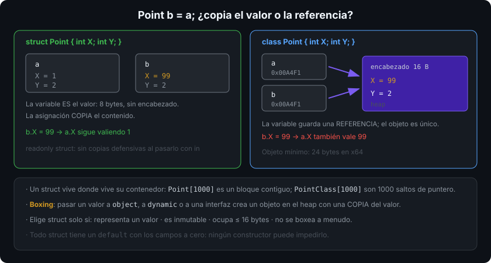

# `struct`: tipos por valor

## 🎯 Objetivos

Al finalizar este archivo, comprenderás:

- Qué distingue a un tipo por valor de uno por referencia al copiarlo, pasarlo y almacenarlo
- Por qué un `struct` mutable es una fuente de bugs y qué resuelve `readonly struct`
- Qué es el boxing, cuándo ocurre sin que lo veas y cuánto cuesta
- Cómo se comportan `Equals`, `GetHashCode` y `default` en un `struct`
- Los criterios reales para elegir `struct` en vez de `class`

## 📋 Conceptos clave

### 1. El valor **es** la variable

```csharp
public struct Point
{
    public int X;
    public int Y;
}

var a = new Point { X = 1, Y = 2 };
Point b = a;        // COPIA los 8 bytes: dos valores independientes
b.X = 99;
Console.WriteLine(a.X);   // 1: a no se ha enterado
```

Con una `class` ambas variables apuntarían al mismo objeto (semana 04). Con un `struct` no hay referencia que compartir: **la asignación copia el contenido**.



### 2. Dónde vive un `struct`

No es cierto que "los structs van en la pila": un `struct` vive **donde vive su contenedor**. Una variable local va a la pila (o a un registro); un campo `struct` de una clase vive dentro del objeto en el heap; un `Point[]` guarda los puntos inline, uno detrás de otro, sin indirecciones.

Esa contigüidad es la razón de rendimiento real: un array de 1 000 `struct` es un bloque que la CPU recorre en línea recta; un array de 1 000 objetos son 1 000 saltos de puntero.

### 3. `readonly struct`

```csharp
public readonly struct Money(decimal amount, string currency)
{
    public decimal Amount { get; } = amount;
    public string Currency { get; } = currency;

    public Money Add(Money other) => new(Amount + other.Amount, Currency);   // devuelve otro valor
}
```

`readonly` promete que ningún miembro modifica el estado. Ventaja concreta: al pasar el `struct` como `in` o al leerlo desde un campo `readonly`, el compilador **no necesita hacer copias defensivas**. Sin `readonly`, cada llamada a un método sobre un campo de solo lectura copia la estructura entera por si acaso.

Regla del bootcamp: **todo `struct` es `readonly`** salvo justificación medida.

### 4. El `struct` mutable y sus trampas

```csharp
var points = new List<Point> { new() { X = 1 } };
// points[0].X = 5;      // no compila: points[0] devuelve una COPIA
var copy = points[0];
copy.X = 5;              // modifica la copia; la lista sigue igual

Point[] array = [new() { X = 1 }];
array[0].X = 5;          // esto SÍ funciona: el indexador de array da acceso directo
```

La diferencia entre `List<T>` (propiedad indexadora → copia) y `T[]` (acceso directo) es exactamente el tipo de sutileza que hace peligroso un `struct` mutable. Con `readonly struct` el compilador te obliga a crear un valor nuevo y el problema desaparece.

### 5. Boxing

```csharp
int n = 42;
object boxed = n;                 // BOXING: se crea un objeto en el heap con una copia
int back = (int)boxed;            // unboxing: copia de vuelta

IComparable c = 42;               // boxing: la interfaz es un tipo por referencia
Console.WriteLine($"{n}");        // NO hay boxing desde C# 10 (interpolación con handler)
object[] items = [1, 2, 3];       // 3 boxings
```

El boxing asigna memoria y añade una indirección. Ocurre al convertir un tipo por valor a `object`, a `dynamic` o **a una interfaz**. Los genéricos con restricción de tipo evitan casi todos (archivo 05): `List<int>` no hace boxing, `ArrayList` sí.

### 6. `Equals`, `GetHashCode` y `default`

```csharp
var p = default(Point);           // todos los campos a cero, sin constructor
Console.WriteLine(p.X);           // 0

// Sin redefinir: ValueType.Equals compara campo a campo POR REFLEXIÓN si hay campos por referencia
public readonly struct Sku : IEquatable<Sku>
{
    public Sku(string value) => Value = value;
    public string Value { get; }

    public bool Equals(Sku other) => Value == other.Value;                 // sin boxing
    public override bool Equals(object? obj) => obj is Sku s && Equals(s);
    public override int GetHashCode() => Value.GetHashCode(StringComparison.Ordinal);
    public static bool operator ==(Sku a, Sku b) => a.Equals(b);
    public static bool operator !=(Sku a, Sku b) => !a.Equals(b);
}
```

Dos avisos importantes: todo `struct` tiene siempre un valor `default` con los campos a cero (no puedes prohibirlo, ni siquiera con un constructor que valide), y la implementación heredada de `Equals` puede ser lenta y hacer boxing. Por eso un `struct` público implementa `IEquatable<T>`… o mejor: se declara como `readonly record struct` (archivo 02) y el compilador lo genera todo.

### 7. Cuándo elegir `struct`

Según las guías de diseño de .NET, usa `struct` si se cumplen **todas**:

- Representa un **valor** único (dinero, coordenada, medida, identificador)
- Es **inmutable**
- Ocupa poco: como referencia, **≤ 16 bytes**
- No se va a boxear con frecuencia

Ejemplos de la BCL: `int`, `DateTime`, `Guid`, `TimeSpan`, `Span<T>`. Si tu tipo tiene identidad, ciclo de vida o herencia, es una `class`.

## 🔬 Bajo el capó

Un `struct` no tiene encabezado de objeto: sus 8 bytes de `Point` son 8 bytes, frente a los 24 mínimos de una clase equivalente. A cambio, cada paso por parámetro copia esos bytes; por eso `in` (semana 02) pasa una referencia de solo lectura y evita la copia en estructuras grandes.

Todos los `struct` heredan de `System.ValueType`, que redefine `Equals` y `GetHashCode`. Si el `struct` solo contiene campos "blittables" (tipos numéricos sin referencias), el runtime compara la memoria byte a byte; en cuanto hay un campo por referencia, cae a una comparación por reflexión mucho más lenta. `GetHashCode` heredado puede llegar a usar **solo el primer campo**: dos valores distintos con el mismo primer campo colisionan siempre.

El boxing es un `newobj` implícito: encabezado + copia del valor. Un bucle que boxea un millón de veces genera un millón de objetos de generación 0 — el patrón de asignación que verás perseguir con BenchmarkDotNet en la semana 13.

## ⚠️ Errores comunes

- `struct` mutable: copias inesperadas y modificaciones que se pierden.
- Structs grandes pasados por valor en bucles calientes.
- Confiar en el `Equals`/`GetHashCode` heredados para un `struct` público.
- Asumir que existe un constructor que impide el estado inválido: `default(T)` siempre existe.
- Boxing invisible al usar interfaces no genéricas (`IComparable`, `ArrayList`, `object`).

## 📚 Recursos adicionales

- [Tipos de estructura](https://learn.microsoft.com/dotnet/csharp/language-reference/builtin-types/struct)
- [Elegir entre `class` y `struct`](https://learn.microsoft.com/dotnet/standard/design-guidelines/choosing-between-class-and-struct)
- [Boxing y unboxing](https://learn.microsoft.com/dotnet/csharp/programming-guide/types/boxing-and-unboxing)
- [`readonly struct` y copias defensivas](https://learn.microsoft.com/dotnet/csharp/write-safe-efficient-code)

## ✅ Checklist de verificación

- [ ] Predigo el resultado de copiar un `struct` y de copiar una `class`
- [ ] Declaro mis `struct` como `readonly` por defecto
- [ ] Identifico los puntos donde ocurre boxing en un fragmento de código
- [ ] Implemento `IEquatable<T>` (o uso `record struct`) en todo `struct` público
- [ ] Aplico los cuatro criterios antes de elegir `struct`
