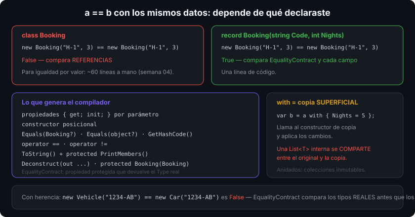

# `record`: igualdad por valor generada

## 🎯 Objetivos

Al finalizar este archivo, comprenderás:

- Qué genera el compilador al declarar un `record` y cuánto código te ahorra
- La diferencia entre `record class`, `record struct` y `readonly record struct`
- Cómo funciona `with` y qué copia exactamente (copia superficial)
- Cómo se comporta la igualdad de records con herencia (`EqualityContract`)
- Cuándo un `record` es la elección correcta y cuándo no

## 📋 Conceptos clave

### 1. Un `record` en una línea

```csharp
public sealed record Booking(string Code, DateOnly Date, int Nights);

var a = new Booking("H-1", new DateOnly(2026, 4, 1), 3);
var b = new Booking("H-1", new DateOnly(2026, 4, 1), 3);

Console.WriteLine(a == b);           // True: igualdad por VALOR
Console.WriteLine(a);                // Booking { Code = H-1, Date = 01/04/2026, Nights = 3 }
var (code, date, nights) = a;        // deconstrucción generada
```

Con esa línea el compilador genera: propiedades `init` por cada parámetro, constructor, `Equals(Booking?)` y `Equals(object?)`, `GetHashCode`, `operator ==`/`!=`, `ToString()`, `Deconstruct` y un constructor de copia. Escribirlo a mano son unas 60 líneas (semana 04, archivo 05).



### 2. Las cuatro variantes

```csharp
public record class Customer(string Name);            // referencia (class es implícito)
public record Customer2(string Name);                 // idéntico al anterior
public record struct Point(int X, int Y);             // valor, propiedades MUTABLES (get/set)
public readonly record struct Money(decimal Amount);  // valor, inmutable: la opción recomendada
```

Ojo con `record struct` sin `readonly`: sus propiedades posicionales se generan con `get`/`set`, no con `init`. Si quieres el valor inmutable — y casi siempre lo quieres (archivo 01) — escribe `readonly record struct`.

### 3. `with`: copia con cambios

```csharp
var original = new Booking("H-1", new DateOnly(2026, 4, 1), 3);
var extended = original with { Nights = 5 };     // nuevo objeto; original intacto

Console.WriteLine(original.Nights);   // 3
Console.WriteLine(extended.Code);     // H-1
```

`with` invoca el constructor de copia generado y aplica los cambios: es una **copia superficial**. Si el record contiene una `List<T>`, ambos objetos comparten la misma lista — y mutarla se ve desde los dos. Para datos anidados, usa colecciones inmutables o vuelve a construir.

### 4. Cuerpo, validación y miembros

```csharp
public sealed record Booking(string Code, DateOnly Date, int Nights)
{
    public int Nights { get; init; } = Nights > 0
        ? Nights
        : throw new ArgumentOutOfRangeException(nameof(Nights));   // ✅ validar en el inicializador

    public decimal Total(decimal rate) => rate * Nights;            // métodos normales
    public string Label => $"{Code} ({Nights} noches)";
}
```

Un `record` admite cuerpo con miembros como cualquier clase. Para validar hay dos vías: redeclarar la propiedad con validación en el inicializador (como arriba) o escribir un constructor con guard clauses y una factoría `Create`.

### 5. Igualdad con herencia: `EqualityContract`

```csharp
public record Vehicle(string Plate);
public sealed record Car(string Plate) : Vehicle(Plate);

Vehicle v = new Vehicle("1234-AB");
Vehicle c = new Car("1234-AB");
Console.WriteLine(v == c);     // False: los tipos en tiempo de ejecución no coinciden
```

Cada `record` genera una propiedad protegida `EqualityContract` que devuelve su `Type`, y `Equals` la compara primero. Resultado: un `Car` nunca es igual a un `Vehicle` aunque todos sus datos coincidan — justo lo contrario del clásico bug de `Equals` mal implementado en jerarquías de clases.

Un `record` puede heredar solo de otro `record` (no de una `class`, ni al revés).

### 6. `record` frente a `class` y a `struct`

| Necesitas… | Elige |
|---|---|
| Datos inmutables con igualdad por valor, DTO, evento, mensaje | `sealed record` |
| Valor pequeño (≤ 16 bytes) e inmutable | `readonly record struct` |
| Identidad, ciclo de vida, estado mutable, servicios | `sealed class` |
| Jerarquía con comportamiento polimórfico | `abstract class` + derivadas |

Un `record` **no** es "una clase mejor": es una clase orientada a **datos**. Si tu tipo tiene métodos que mutan estado y una identidad propia (una cuenta bancaria, un repositorio), sigue siendo una `class`.

### 7. Records en la práctica

```csharp
public sealed record CreateBookingDto(string Code, int Nights);            // DTO de entrada
public sealed record BookingCreated(Guid Id, DateTimeOffset At);           // evento de dominio
public readonly record struct RoomId(Guid Value);                          // identificador tipado
```

Los identificadores tipados (`RoomId` en vez de `Guid` suelto) evitan la clase de bug en la que se pasa el id de la habitación donde iba el del cliente: el compilador los distingue. Cuesta una línea.

## 🔬 Bajo el capó

Un `record` es una `class` normal en el IL con miembros generados; nada nuevo en el runtime. El `Equals` generado compara `EqualityContract` y después **cada campo** con `EqualityComparer<T>.Default`, y el `GetHashCode` los combina — todo código C# normal que puedes ver en SharpLab.

`with` compila a una llamada al **constructor de copia** protegido `protected Booking(Booking original)` seguida de las asignaciones de los miembros cambiados; por eso es superficial y por eso una clase derivada hereda el comportamiento correcto sin escribir nada. El `ToString()` generado usa un `PrintMembers` protegido que la derivada extiende: por eso un record derivado imprime también sus propias propiedades.

En un `record struct` el `Equals` generado compara campo a campo sin reflexión ni boxing, lo que lo hace mucho más rápido que el `ValueType.Equals` heredado que verías en un `struct` a pelo (archivo 01).

## ⚠️ Errores comunes

- Usar `record` para servicios o entidades con identidad y estado mutable.
- `record struct` sin `readonly`: propiedades mutables por sorpresa.
- Esperar que `with` clone en profundidad: comparte las referencias internas.
- Meter una `List<T>` mutable en un record "inmutable".
- Olvidar validar: un `record` posicional acepta cualquier valor si no haces nada.
- Creer que dos records de tipos distintos con los mismos datos son iguales.

## 📚 Recursos adicionales

- [Records (guía de C#)](https://learn.microsoft.com/dotnet/csharp/language-reference/builtin-types/record)
- [Tutorial: tipos de datos inmutables con records](https://learn.microsoft.com/dotnet/csharp/whats-new/tutorials/records)
- [Expresión `with`](https://learn.microsoft.com/dotnet/csharp/language-reference/operators/with-expression)
- [`record struct` (C# 10)](https://learn.microsoft.com/dotnet/csharp/language-reference/builtin-types/record#value-type-records)

## ✅ Checklist de verificación

- [ ] Enumero los miembros que genera un `record` posicional
- [ ] Elijo entre `record`, `readonly record struct` y `class` con criterio
- [ ] Sé que `with` hace copia superficial y actúo en consecuencia
- [ ] Explico por qué `Car` no es igual a `Vehicle` con los mismos datos
- [ ] Valido los datos de un record en vez de confiar en la sintaxis posicional
