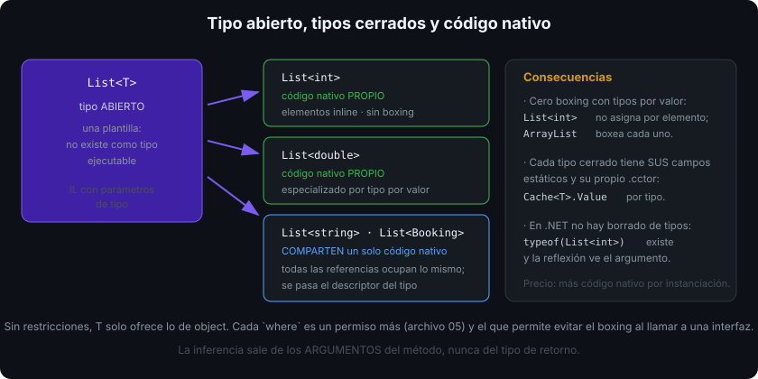

# Genéricos

## 🎯 Objetivos

Al finalizar este archivo, comprenderás:

- Qué problema resuelven los genéricos frente a `object` y frente a duplicar código
- Cómo se declaran tipos y métodos genéricos y cuándo se infiere el argumento de tipo
- Qué significan tipo abierto y tipo cerrado, y qué hace `default(T)`
- Cómo se comportan los miembros `static` en un tipo genérico
- Qué código genera el runtime por cada instanciación y por qué importa

## 📋 Conceptos clave

### 1. El problema: `object` pierde el tipo

```csharp
// Antes de los genéricos (.NET 1.x)
var list = new System.Collections.ArrayList();
list.Add(42);
list.Add("cuarenta y dos");           // compila: nadie lo impide
int n = (int)list[1];                 // InvalidCastException en tiempo de EJECUCIÓN

// Con genéricos
var typed = new List<int>();
typed.Add(42);
// typed.Add("texto");                // error en tiempo de COMPILACIÓN
int m = typed[0];                     // sin cast, sin boxing
```

Los genéricos dan **seguridad de tipos en compilación** y evitan el boxing de los tipos por valor (archivo 01). La alternativa sin genéricos era duplicar la misma clase para `int`, `string`, `Booking`…

### 2. Tipos genéricos

```csharp
public sealed class Box<T>
{
    private T? _value;
    private bool _hasValue;

    public void Set(T value) { _value = value; _hasValue = true; }
    public bool TryGet(out T value)
    {
        value = _value!;
        return _hasValue;
    }
}

var box = new Box<Booking>();    // tipo CERRADO: T ya es Booking
```

`Box<T>` es un tipo **abierto** (una plantilla); `Box<Booking>` es un tipo **cerrado**, un tipo real con su propia identidad: `typeof(Box<int>) != typeof(Box<string>)`.

Convención de nombres: `T` cuando hay uno solo; `TKey`, `TValue`, `TResult`, `TError` cuando hay varios — siempre con prefijo `T`.

### 3. Métodos genéricos e inferencia

```csharp
public static class Collections
{
    public static IReadOnlyList<TResult> MapAll<TSource, TResult>(
        IEnumerable<TSource> source, Func<TSource, TResult> map)
    {
        List<TResult> result = [];
        foreach (TSource item in source) result.Add(map(item));
        return result;
    }
}

var names = Collections.MapAll(bookings, b => b.Code);       // inferencia: TSource y TResult deducidos
var forced = Collections.MapAll<Booking, string>(bookings, b => b.Code);  // explícito si hace falta
```

El compilador infiere los argumentos de tipo **a partir de los argumentos del método**, nunca del tipo de retorno: por eso `var x = Create();` con `T Create<T>()` no compila sin indicar `Create<int>()`.

### 4. `default(T)` y `T?`

```csharp
public static T? FirstOrDefaultValue<T>(IReadOnlyList<T> items)
    => items.Count > 0 ? items[0] : default;      // 0 para int, null para string, struct vacío…
```

`default(T)` es el valor cero del tipo: `null` para referencias, `0`/`false` para numéricos, un `struct` con todos los campos a cero. Para un `T` sin restricciones, `T?` significa "puede ser el valor por defecto" — y solo equivale a "puede ser null" cuando `T` es un tipo por referencia (semana 09).

### 5. `static` en tipos genéricos: uno por instanciación

```csharp
public sealed class Counter<T>
{
    public static int Instances;
}

_ = new Counter<int>();    Counter<int>.Instances++;
_ = new Counter<string>(); Counter<string>.Instances++;
// Counter<int>.Instances y Counter<string>.Instances son campos DISTINTOS
```

Cada tipo cerrado tiene sus propios campos estáticos y su propio constructor estático. Esto se usa a propósito para cachés por tipo (`Cache<T>.Value`), un patrón muy común en bibliotecas de alto rendimiento.

### 6. Genéricos en la BCL

```csharp
List<T>, Dictionary<TKey, TValue>, HashSet<T>, Queue<T>, Stack<T>       // colecciones (semana 02)
IEnumerable<T>, IReadOnlyList<T>, IComparer<T>, IEqualityComparer<T>    // contratos
Func<T, TResult>, Action<T>, Predicate<T>                               // delegados (semana 07)
Nullable<T> (es decir, T?), Task<T>, ValueTask<T>, Span<T>, Memory<T>
Result<T, TError>                                                        // el tuyo, esta semana
```

`Nullable<T>` es un `readonly struct` genérico: `int?` es literalmente `Nullable<int>`, con `HasValue`, `Value`, `GetValueOrDefault()` y conversión implícita desde `int`.

### 7. Lo que no puedes hacer (todavía)

```csharp
public static T Create<T>() => new T();        // ❌ sin la restricción new()
public static T Sum<T>(T a, T b) => a + b;     // ❌ sin la restricción de operadores
public static bool Bigger<T>(T a, T b) => a.CompareTo(b) > 0;   // ❌ T no sabe comparar
```

Un `T` sin restricciones solo ofrece lo de `object`. Para pedirle más está el `where` — el archivo 05.

## 🔬 Bajo el capó

.NET **no** hace borrado de tipos (a diferencia de Java): los genéricos están en el IL y en el runtime, así que `typeof(List<int>)` existe de verdad y la reflexión ve el argumento de tipo.

El JIT comparte el código nativo entre todas las instanciaciones con argumentos de **tipo por referencia** (`List<string>` y `List<Booking>` ejecutan el mismo código, con un puntero al descriptor de tipo), pero genera **código especializado por cada tipo por valor** (`List<int>` y `List<double>` tienen su propio código máquina). De ahí las dos consecuencias prácticas: cero boxing con tipos por valor, y un poco más de código nativo y de tiempo de arranque por cada instanciación distinta.



Los campos estáticos por tipo cerrado salen de ahí: cada instanciación tiene su propia entrada de tipo en el runtime, con su propio almacenamiento estático.

## ⚠️ Errores comunes

- Usar `object` (o `dynamic`) donde un genérico daría seguridad en compilación.
- Esperar inferencia a partir del tipo de retorno.
- Suponer que `Counter<int>.Instances` y `Counter<string>.Instances` comparten valor.
- Creer que `T?` siempre significa "puede ser null".
- Crear genéricos con cinco parámetros de tipo: nadie sabe ya qué es `TOut2`.

## 📚 Recursos adicionales

- [Genéricos en .NET](https://learn.microsoft.com/dotnet/csharp/fundamentals/types/generics)
- [Métodos genéricos](https://learn.microsoft.com/dotnet/csharp/programming-guide/generics/generic-methods)
- [Genéricos en el runtime](https://learn.microsoft.com/dotnet/standard/generics/)
- [`Nullable<T>`](https://learn.microsoft.com/dotnet/api/system.nullable-1)

## ✅ Checklist de verificación

- [ ] Explico qué gano frente a `object`: tipos en compilación y ausencia de boxing
- [ ] Declaro tipos y métodos genéricos con nombres `T`/`TKey`/`TResult`
- [ ] Sé cuándo el compilador puede inferir y cuándo hay que ser explícito
- [ ] Predigo qué vale `default(T)` para una referencia, un numérico y un struct
- [ ] Explico por qué `List<int>` y `List<string>` no comparten código nativo
