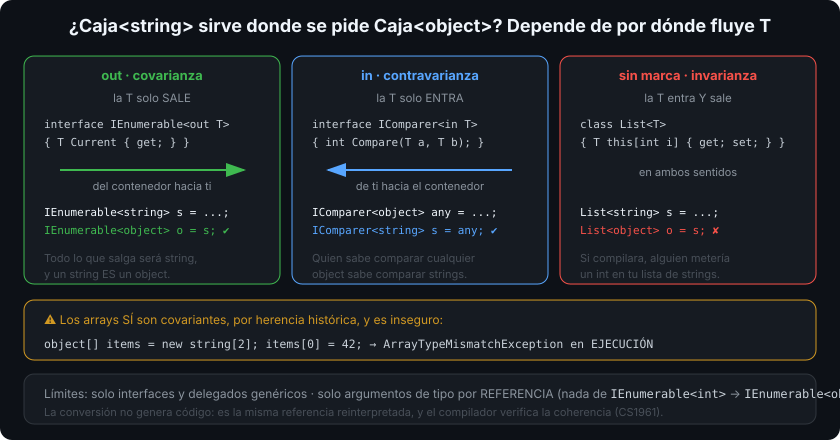

# Varianza: `in` y `out`

## 🎯 Objetivos

Al finalizar este archivo, comprenderás:

- Qué significa que `IEnumerable<string>` sirva donde se espera `IEnumerable<object>`
- Qué es covarianza (`out`), contravarianza (`in`) e invarianza
- Por qué `List<string>` **no** es un `List<object>` y por qué los arrays sí lo permiten (y es inseguro)
- Cómo se anotan tus propias interfaces y delegados genéricos
- Los límites de la varianza en C#

## 📋 Conceptos clave

### 1. El problema

```csharp
IEnumerable<string> names = ["Ada", "Linus"];
IEnumerable<object> objects = names;      // ✅ compila: IEnumerable<out T> es covariante

List<string> list = ["Ada"];
// List<object> bad = list;               // ❌ no compila: List<T> es invariante
```

La pregunta de fondo: si `string` "es un" `object`, ¿`Caja<string>` "es una" `Caja<object>`? Depende de **qué haga la caja con la T**.



### 2. Covarianza (`out`): la T solo **sale**

```csharp
public interface IReadOnlyBox<out T>
{
    T Get();                       // T aparece solo como tipo de RETORNO
    // void Set(T value);          // ❌ no compilaría: T entraría
}

IReadOnlyBox<string> strings = GetBox();
IReadOnlyBox<object> objects = strings;      // seguro: todo lo que salga será string, que ES object
```

Si de la interfaz solo salen valores, sustituir `T` por una base es seguro: quien recibe un `object` se conforma con un `string`.

Ejemplos de la BCL: `IEnumerable<out T>`, `IReadOnlyList<out T>`, `IEnumerator<out T>`, `Func<..., out TResult>`, `Task<T>` (por diseño, no marcado).

### 3. Contravarianza (`in`): la T solo **entra**

```csharp
public interface IWriter<in T>
{
    void Write(T value);           // T aparece solo como PARÁMETRO
}

IWriter<object> anything = GetObjectWriter();
IWriter<string> strings = anything;          // seguro: quien sabe escribir cualquier object sabe escribir strings
```

Es el caso inverso y desconcierta al principio: un escritor **más general** vale donde se pide uno más específico.

Ejemplos: `IComparer<in T>`, `IEqualityComparer<in T>`, `Action<in T>`, `IObserver<in T>`.

```csharp
IComparer<object> byHash = Comparer<object>.Create((a, b) => a!.GetHashCode().CompareTo(b!.GetHashCode()));
List<string> words = ["b", "a"];
words.Sort(byHash);          // acepta un IComparer<object> porque IComparer<in T> es contravariante
```

### 4. Invarianza: la T entra **y** sale

```csharp
public interface IBox<T>       // sin in ni out
{
    T Get();
    void Set(T value);
}
```

`List<T>`, `IList<T>`, `Dictionary<TKey, TValue>` son invariantes. Si `List<string>` pudiera usarse como `List<object>`, alguien podría meter un `int` en tu lista de strings. La invarianza no es una limitación: es la única opción segura cuando la T fluye en ambos sentidos.

### 5. Arrays: covarianza insegura heredada

```csharp
object[] items = new string[2];      // compila desde .NET 1.0
items[0] = 42;                       // ArrayTypeMismatchException en tiempo de EJECUCIÓN
```

Los arrays son covariantes por decisión histórica, y el precio es una **comprobación de tipo en cada escritura** más la posibilidad de que reviente en ejecución. Las interfaces genéricas se diseñaron después y con varianza segura verificada por el compilador. Moraleja práctica: no pases `object[]` esperando poder escribir en él.

### 6. Anotar tus propios tipos

```csharp
public interface IResultReader<out TValue, out TError>    // solo devuelve
{
    TValue Value { get; }
    TError Error { get; }
}

public delegate TResult Transform<in TSource, out TResult>(TSource source);

Transform<object, string> general = o => o?.ToString() ?? "";
Transform<string, object> specific = general;     // in en el origen, out en el destino
```

El compilador verifica la coherencia: si marcas `out` y usas la T como parámetro, error CS1961. Esa comprobación es la garantía de que la varianza nunca falla en ejecución.

### 7. Los límites

- Solo en **interfaces y delegados** genéricos; nunca en clases, structs ni métodos genéricos.
- Solo con argumentos de **tipo por referencia**: `IEnumerable<int>` **no** es `IEnumerable<object>` (haría falta boxing).
- Solo en una dirección: un parámetro de tipo es `in`, `out` o invariante, nunca dos cosas.
- No aplica a `ref`/`out` de parámetros de método ni a restricciones.

## 🔬 Bajo el capó

`in` y `out` se emiten como marcas en los metadatos del parámetro de tipo. El CLR las respeta al hacer las conversiones de referencia: convertir `IEnumerable<string>` a `IEnumerable<object>` no genera código, es la **misma referencia** reinterpretada, coste cero.

Que la varianza no funcione con tipos por valor viene de ahí: no hay conversión de referencia posible entre `int` y `object` sin boxing, y el runtime no va a copiar y convertir cada elemento por detrás.

La covarianza de arrays, en cambio, se paga en cada `stelem`: el runtime comprueba que el elemento que escribes es compatible con el tipo real del array. Es una de las razones por las que `Span<T>` (semana 12), que es invariante, puede ser más rápido que un `T[]` en escritura.

## ⚠️ Errores comunes

- Intentar marcar `out` en una interfaz que también recibe la T.
- Esperar varianza con tipos por valor.
- Escribir en un `object[]` que en realidad es un `string[]`.
- Creer que `List<Derivada>` sirve donde se pide `List<Base>` (usa `IEnumerable<Base>` o `IReadOnlyList<Base>`).
- Anotar con varianza por costumbre: si la T entra y sale, invariante es lo correcto.

## 📚 Recursos adicionales

- [Covarianza y contravarianza](https://learn.microsoft.com/dotnet/csharp/programming-guide/concepts/covariance-contravariance/)
- [Varianza en interfaces genéricas](https://learn.microsoft.com/dotnet/csharp/programming-guide/concepts/covariance-contravariance/variance-in-generic-interfaces)
- [Crear interfaces genéricas variantes](https://learn.microsoft.com/dotnet/csharp/programming-guide/concepts/covariance-contravariance/creating-variant-generic-interfaces)
- [`ArrayTypeMismatchException`](https://learn.microsoft.com/dotnet/api/system.arraytypemismatchexception)

## ✅ Checklist de verificación

- [ ] Explico covarianza y contravarianza con un ejemplo de cada una
- [ ] Sé por qué `List<T>` debe ser invariante
- [ ] Reconozco el peligro de la covarianza de arrays
- [ ] Anoto `in`/`out` en mis interfaces según hacia dónde fluye la T
- [ ] Recuerdo que la varianza no aplica a tipos por valor
